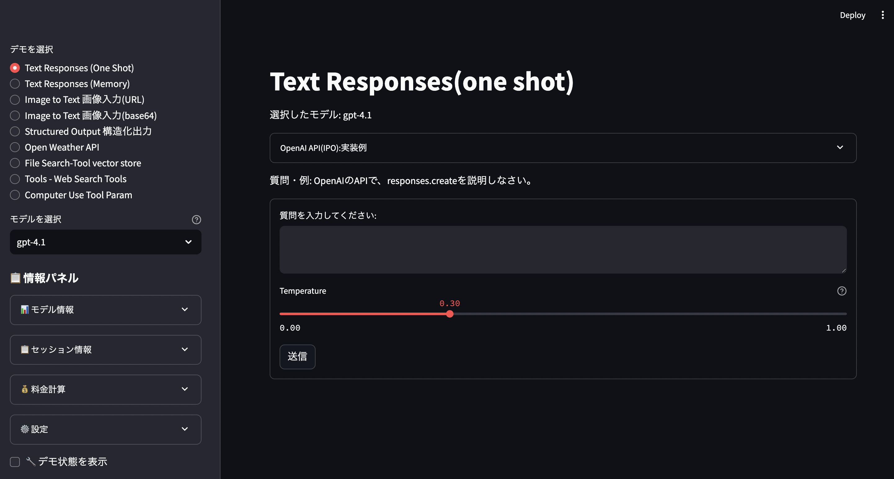
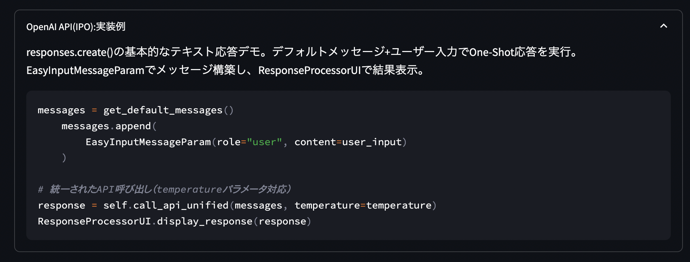

# 🤖 Anthropic API From Scratch with Streamlit

## 包括的な学習プロジェクト - スクラッチで Anthropic API + Streamlit
- If you prefer English, please use translation tools like Google Translate to read the English version.
#### 主要なAnthropic API(SDK)は網羅しています。
- プログラム（9個）
- 巣部プログラム（49個）

## OpenAI API -> Anthropic API のマイグレーション：仕様書
[OpenAPAPI->Anthropic API migration 仕様書]
[Migration](doc/openai_to_anthropic_migration_spec.md)

---
## 🔗 関連プロジェクト## 🔗 関連プロジェクト


| プロジェクト                                                             | 説明                                         | ステータス |
| ------------------------------------------------------------------------ | -------------------------------------------- | ---------- |
| [openai_api_jp](https://github.com/nakashima2toshio/openai_api_jp)       | OpenAI API完全ガイド（本プロジェクト）       | ✅ 公開中  |
| [anthropic_api_jp](https://github.com/nakashima2toshio/anthropic_api_jp) | Anthropic Claude API活用                     | ✅ 公開中  |
| [openai_rag_jp](https://github.com/nakashima2toshio/openai_rag_jp)       | RAG実装パターン集（cloud版、Local-Qdrant版） | ✅ 公開中  |
| [openai_mcp_jp](https://github.com/nakashima2toshio/openai_mcp_jp)       | MCP(Model Context Protocol)実装              | 🚧 整備中  |
| [openai_django_jp](https://github.com/nakashima2toshio/openai_django_jp) | OpenAI API + Django実装                      | ✅ 公開中  |
| [openai_agent_jp](https://github.com/nakashima2toshio/openai_agent_jp)   | AIエージェント構築                           | 📝 作成中  |


## 📖 プロジェクト概要

本プロジェクトは、Anthropic Claude APIの習得を主眼とした包括的な学習リソースです。基本的なテキスト生成から高度なマルチモーダル処理、構造化出力、推論パターンまで、30以上の実践的なデモパターンを通じて段階的に学習できます。

### 🎯 主な特徴

- **体系的な学習パス**: 初心者から上級者まで段階的に学習可能
- **実践的なデモ**: 7つの主要アプリケーション、30以上のデモパターン
- **完全な日本語対応**: UIとドキュメントの完全日本語化
- **統合ヘルパーライブラリ**: 効率的な開発を支援する共通機能
- **詳細な技術文書**: 各機能の設計書とIPO（Input-Process-Output）ドキュメント

---

## 🚀 クイックスタート

### 環境準備

詳細な環境構築手順: [README_preparation.md](./README_preparation.md)

```bash
# 1. リポジトリクローン
git clone https://github.com/nakashima2toshio/anthropic_api_jp.git
cd anthropic_api_jp

# 2. 依存関係インストール
pip install -r requirements.txt

# 3. 環境変数設定
export ANTHROPIC_API_KEY='your-anthropic-api-key'

# 4. 基本デモ実行
streamlit run a10_00_responses_api.py --server.port=8501
```

### 必要な環境

- **OS**: macOS / Linux / Windows
- **Python**: 3.8以上
- **メモリ**: 4GB以上推奨
- **Anthropic API**: Tier2以上のアカウント（$40クレジット推奨）

---

## 📚 学習コンテンツ

### 🎓 Anthropic API速習

- **[a0_simple_api.ipynb](./a0_simple_api.ipynb)** - Jupyter NotebookでAPI基礎を学習

### 🏗️ 主要アプリケーション

#### 1️⃣ [a10_00_responses_api.py](./a10_00_responses_api.py) - **統合APIデモ**

包括的なClaude API機能を体験できる統合デモアプリケーション


| 機能                   | 説明                                    | 技術要素              |
| ---------------------- | --------------------------------------- | --------------------- |
| 🤖**テキスト応答**     | ワンショット・メモリ対応の対話システム  | `messages.create` API |
| 🖼️**マルチモーダル** | 画像入力（URL・Base64）からテキスト生成 | Vision API            |
| 📊**構造化出力**       | Pydanticモデルによる型安全な出力        | Structured Outputs    |
| 🌤️**外部API連携**    | OpenWeatherMap APIとの統合              | Function Calling      |
| 📁**ファイル検索**     | Vector Store使用のRAG機能               | Embeddings            |
| 🌐**Web検索**          | リアルタイムWeb検索ツール               | Tool Use              |
| 💻**Computer Use**     | AI自動操作デモ                          | Advanced Features     |
| 🧠**推論モデル**       | o1/o3/o4シリーズ対応                    | Reasoning Models      |

📄 **詳細設計書**: [doc/a00_responses_api.md](./doc/a00_responses_api.md)

---

#### 2️⃣ [a10_01_structured_outputs_parse_schema.py](./a10_01_structured_outputs_parse_schema.py) - **構造化出力**

Pydanticスキーマ検証を用いた型安全な構造化出力の実装


| パターン                   | 説明                                 | 用途      |
| -------------------------- | ------------------------------------ | --------- |
| 📅**イベント抽出**         | テキストからイベント情報を構造化抽出 | 情報抽出  |
| 📦**商品情報**             | 商品データの構造化処理               | Eコマース |
| 👤**ユーザープロファイル** | ユーザー情報の型安全な管理           | CRM       |
| 🧑**人物情報**             | 複雑な人物データの階層構造化         | HR管理    |

📄 **詳細設計書**: [doc/a01_structured_outputs_parse_schema.md](./doc/a01_structured_outputs_parse_schema.md)

---

#### 3️⃣ [a10_02_responses_tools_pydantic_parse.py](./a10_02_responses_tools_pydantic_parse.py) - **ツール使用**

Function CallingとTool Useパターンの実装


| デモ                   | 説明                     | 実装パターン |
| ---------------------- | ------------------------ | ------------ |
| 🌤️**天気取得**       | OpenWeatherMap連携       | 外部API統合  |
| 📰**ニュース検索**     | ニュース情報の取得と整形 | データ取得   |
| 🧮**計算ツール**       | 数式計算の実行           | 計算処理     |
| 🔍**FAQ検索**          | 質問応答システム         | 検索機能     |
| 📋**プロジェクト管理** | タスクの階層構造管理     | 複雑な構造   |

📄 **詳細設計書**: [doc/a02_responses_tools_pydantic_parse.md](./doc/a02_responses_tools_pydantic_parse.md)

---

#### 4️⃣ [a10_03_images_and_vision.py](./a10_03_images_and_vision.py) - **画像処理**

Vision APIを用いたマルチモーダル処理


| 機能                   | 入力形式         | 出力               |
| ---------------------- | ---------------- | ------------------ |
| 🖼️**URL画像分析**    | 画像URL          | テキスト説明・分析 |
| 📤**ローカル画像分析** | Base64エンコード | 詳細な画像解釈     |

📄 **詳細設計書**: [doc/a03_images_and_vision.md](./doc/a03_images_and_vision.md)

---

#### 5️⃣ [a10_04_audio_speeches.py](./a10_04_audio_speeches.py) - **音声処理**

音声処理統合パターンのデモ実装


| 機能                   | 説明                   | 統合サービス |
| ---------------------- | ---------------------- | ------------ |
| 🎤**Text-to-Speech**   | テキストから音声生成   | 外部TTS      |
| 🎧**Speech-to-Text**   | 音声からテキスト変換   | 外部STT      |
| 🌐**音声翻訳**         | 音声の多言語翻訳       | 翻訳API      |
| ⚡**リアルタイム処理** | ストリーミング音声処理 | WebSocket    |
| 🤖**音声エージェント** | 音声対話システム       | チェーン処理 |

📄 **詳細設計書**: [doc/a04_audio_speeches.md](./doc/a04_audio_speeches.md)

---

#### 6️⃣ [a10_05_conversation_state.py](./a10_05_conversation_state.py) - **会話状態管理**

状態管理とツール使用の高度な実装


| 機能                 | 説明                       | 技術要素           |
| -------------------- | -------------------------- | ------------------ |
| 💬**状態維持会話**   | 会話履歴の永続化と管理     | Session State      |
| 🔧**ツール実行**     | カスタムツールの定義と実行 | Tool Use           |
| 🌤️**関数呼び出し** | 外部APIとの連携            | Function Calling   |
| 📊**構造化応答**     | 型安全なツール引数処理     | Pydantic           |
| 🔄**フォローアップ** | 文脈認識の連続対話         | Context Management |

📄 **詳細設計書**: [doc/a05_conversation_state.md](./doc/a05_conversation_state.md)

---

#### 7️⃣ [a10_06_reasoning_chain_of_thought.py](./a10_06_reasoning_chain_of_thought.py) - **推論パターン**

Chain of Thought（CoT）推論パターンの実装


| パターン               | 説明                 | 適用例                 |
| ---------------------- | -------------------- | ---------------------- |
| 📝**段階的推論**       | 問題を順序立てて解決 | 数学問題、アルゴリズム |
| 🔬**仮説検証**         | 科学的手法による検証 | バグ解析、実験計画     |
| 🌳**思考の木探索**     | 複数パスの探索と評価 | パズル、最適化         |
| ⚖️**賛否分析**       | 意思決定のための比較 | 技術選定、判断         |
| 🔄**計画実行振り返り** | 反復的改善プロセス   | プロジェクト管理       |

📄 **詳細設計書**: [doc/a06_reasoning_chain_of_thought.md](./doc/a06_reasoning_chain_of_thought.md)

---

## 🛠️ 共通ライブラリ

### [helper_api.py](./helper_api.py) - **APIヘルパー**

Anthropic API操作の統合ヘルパーライブラリ


| コンポーネント          | 機能                | 特徴                    |
| ----------------------- | ------------------- | ----------------------- |
| ⚙️**ConfigManager**   | YAML設定管理        | シングルトンパターン    |
| 💾**MemoryCache**       | 高速キャッシュ      | TTL付きメモリキャッシュ |
| 💬**MessageManager**    | 会話履歴管理        | 自動制限管理            |
| 🔢**TokenManager**      | トークン管理        | コスト推定機能          |
| 📊**ResponseProcessor** | レスポンス処理      | 自動整形・保存          |
| 🔌**AnthropicClient**   | API統合クライアント | リトライ機能付き        |

📄 **詳細設計書**: [doc/helper_api.md](./doc/helper_api.md)

### [helper_st.py](./helper_st.py) - **UIヘルパー**

Streamlit UI開発支援ライブラリ


| コンポーネント            | 機能             | 特徴                     |
| ------------------------- | ---------------- | ------------------------ |
| 🎨**UIHelper**            | UI要素の統一管理 | 再利用可能コンポーネント |
| 💬**MessageManagerUI**    | 会話UI管理       | セッション状態統合       |
| 📊**ResponseProcessorUI** | レスポンス表示   | インタラクティブ表示     |
| 💾**SessionStateManager** | 状態管理         | 永続化対応               |
| 📈**InfoPanelManager**    | 情報パネル       | コスト・性能表示         |
| 🎯**DemoBase**            | デモ基底クラス   | 共通処理の抽象化         |

📄 **詳細設計書**: [doc/helper_st.md](./doc/helper_st.md)

---

## 📊 技術仕様

### 対応モデル


| カテゴリ      | モデル            | 特徴                   |
| ------------- | ----------------- | ---------------------- |
| **Flagship**  | Claude Opus 4.1   | 最高性能、複雑なタスク |
| **Balanced**  | Claude Sonnet 4   | バランス型、汎用       |
| **Fast**      | Claude 3.5 Haiku  | 高速、軽量タスク       |
| **Vision**    | Claude 3.5 Sonnet | 画像処理対応           |
| **Reasoning** | o1/o3/o4シリーズ  | 高度な推論             |

### 主要機能


| 機能               | 説明                 | 実装状況        |
| ------------------ | -------------------- | --------------- |
| Messages API       | 基本的な対話         | ✅ 完全実装     |
| Vision API         | 画像処理             | ✅ 完全実装     |
| Structured Outputs | 構造化出力           | ✅ 完全実装     |
| Tool Use           | ツール使用           | ✅ 完全実装     |
| Function Calling   | 関数呼び出し         | ✅ 完全実装     |
| Streaming          | ストリーミング応答   | ✅ 実装済み     |
| Caching            | レスポンスキャッシュ | ✅ 実装済み     |
| Token Counting     | トークン管理         | ✅ tiktoken対応 |

---

## 🎯 学習パス

### 📚 初心者向け（基礎）

1. **a0_simple_api.ipynb** - Jupyter NotebookでAPIの基礎を学習
2. **a10_00_responses_api.py** - 統合デモで全機能を体験
3. **a10_01_structured_outputs_parse_schema.py** - 構造化出力の基本

### 🔧 中級者向け（応用）

4. **a10_02_responses_tools_pydantic_parse.py** - ツール使用とPydantic活用
5. **a10_03_images_and_vision.py** - マルチモーダル処理
6. **a10_05_conversation_state.py** - 状態管理の実装

### 🚀 上級者向け（発展）

7. **a10_06_reasoning_chain_of_thought.py** - 高度な推論パターン
8. **a10_04_audio_speeches.py** - 音声処理統合（外部サービス連携）
9. カスタムツール・エージェントの実装

---

## 🖥️ 実行方法

各アプリケーションは独立したStreamlitアプリとして実行できます。ポート番号は環境に応じて調整してください。

```bash
# 統合APIデモ
streamlit run a10_00_responses_api.py --server.port=8501

# 構造化出力デモ
streamlit run a10_01_structured_outputs_parse_schema.py --server.port=8502

# ツール使用デモ
streamlit run a10_02_responses_tools_pydantic_parse.py --server.port=8503

# 画像処理デモ
streamlit run a10_03_images_and_vision.py --server.port=8504

# 音声処理デモ
streamlit run a10_04_audio_speeches.py --server.port=8505

# 会話状態管理デモ
streamlit run a10_05_conversation_state.py --server.port=8506

# 推論パターンデモ
streamlit run a10_06_reasoning_chain_of_thought.py --server.port=8507
```

---

## 🔧 設定とカスタマイズ

### 環境変数

```bash
# 必須
export ANTHROPIC_API_KEY='your-anthropic-api-key'

# オプション（特定機能で使用）
export OPENWEATHER_API_KEY='your-openweather-api-key'  # 天気情報取得
export EXCHANGERATE_API_KEY='your-exchangerate-api-key'  # 為替レート
export LOG_LEVEL='INFO'  # ログレベル設定
export DEBUG_MODE='false'  # デバッグモード
```

### 設定ファイル（config.yml）

```yaml
models:
  default: "claude-3-5-sonnet-20241022"
  categories:
    flagship: ["claude-opus-4-1-20250805"]
    balanced: ["claude-sonnet-4-20250514"]
    fast: ["claude-3-5-haiku-20241022"]

api:
  timeout: 30
  max_retries: 3
  message_limit: 50

cache:
  enabled: true
  ttl: 3600
  max_size: 100

ui:
  theme: "light"
  language: "ja"
  show_timestamps: true
```

---

## 📸 画面例

### メインインターフェース



### IPO（Input-Process-Output）表示



---

## 🧪 テスト

```bash
# 全テスト実行
pytest -v

# カバレッジ測定
pytest --cov

# 特定カテゴリのテスト
pytest -m unit      # ユニットテスト
pytest -m api       # APIテスト
pytest -m slow      # 長時間テスト
```

---

## 📚 関連リソース

### 公式ドキュメント

- [Anthropic Claude API Documentation](https://docs.anthropic.com/)
- [Streamlit Documentation](https://docs.streamlit.io/)
- [Pydantic Documentation](https://docs.pydantic.dev/)

---

## 🤝 コントリビューション

プルリクエストや Issue の作成を歓迎します。大きな変更の場合は、まず Issue を作成して変更内容を議論してください。

---

## 📄 ライセンス

本プロジェクトは教育目的で作成されています。商用利用の際は、Anthropic API の利用規約をご確認ください。

---

## 👨‍💻 作者

**Toshio Nakashima**

- GitHub: [@nakashima2toshio](https://github.com/nakashima2toshio)

---

## 🙏 謝辞

- Anthropic チーム - 優れた Claude API の提供
- Streamlit チーム - 直感的な Web UI フレームワーク
- コミュニティの皆様 - フィードバックと改善提案

---

*最終更新: 2025年1月*
