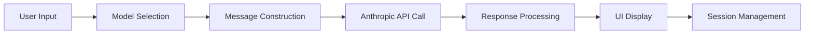
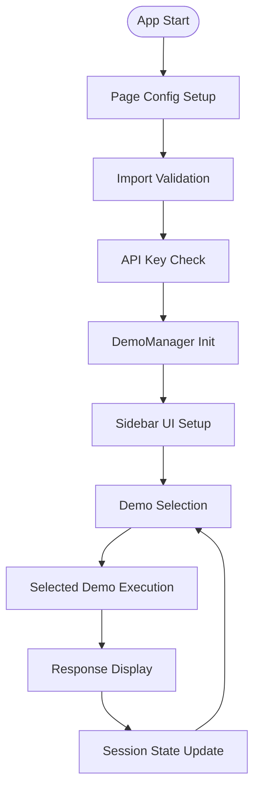
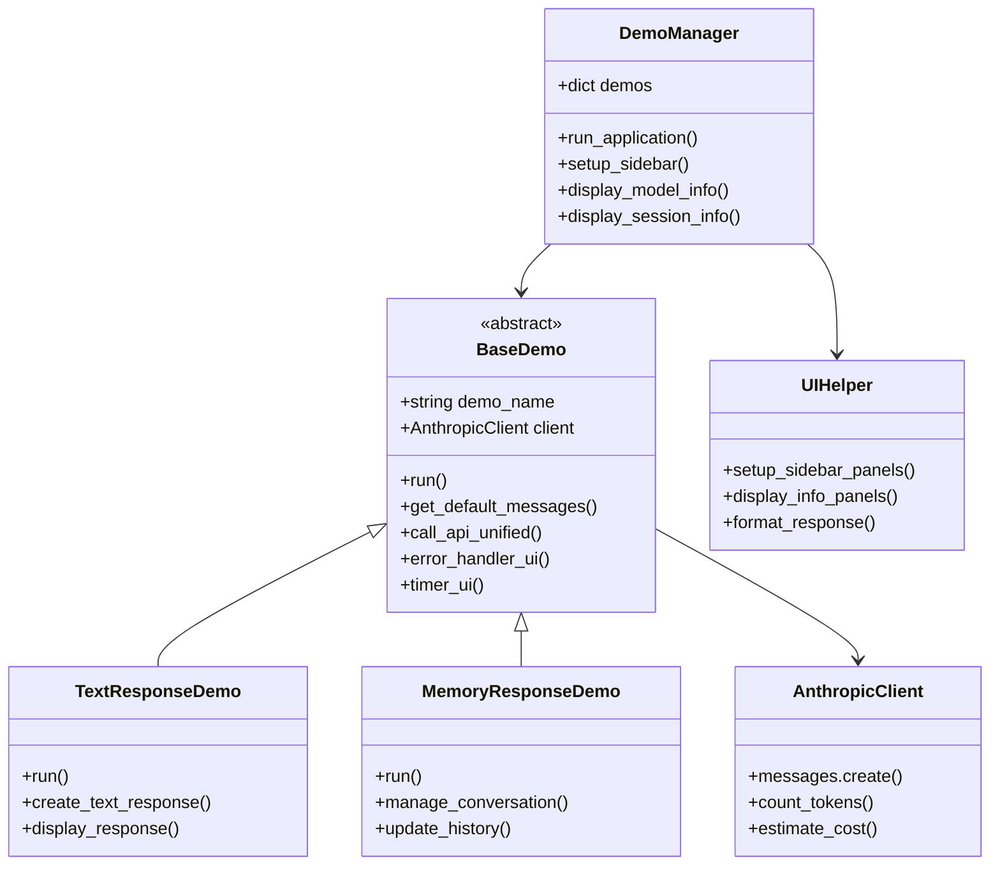
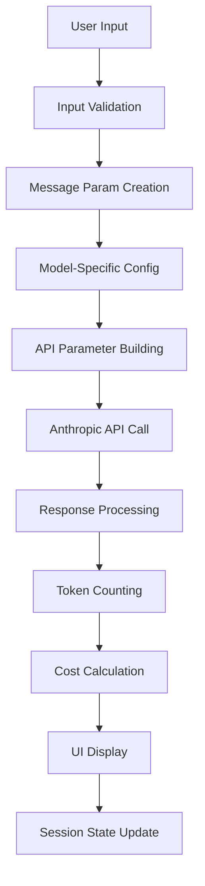
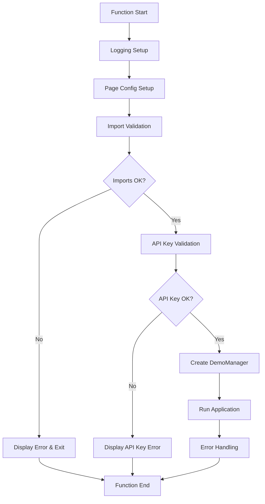
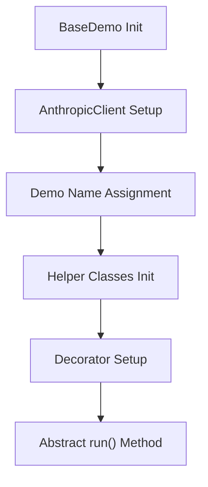
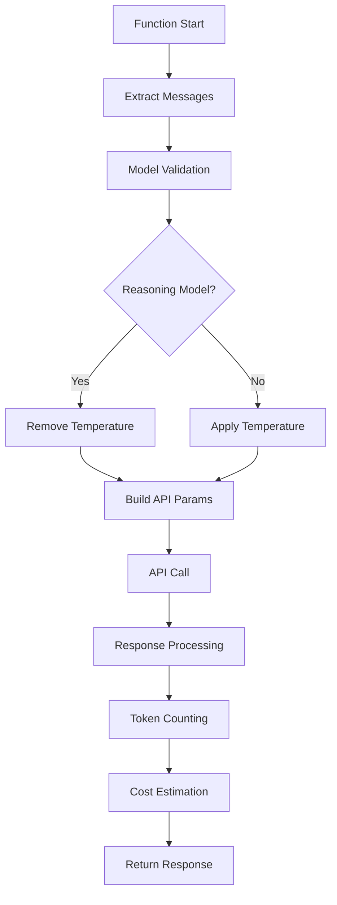
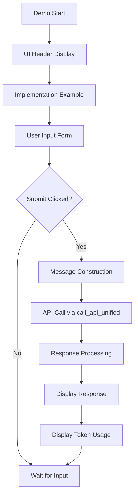
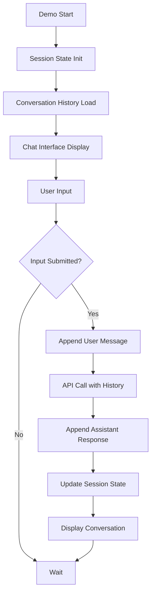
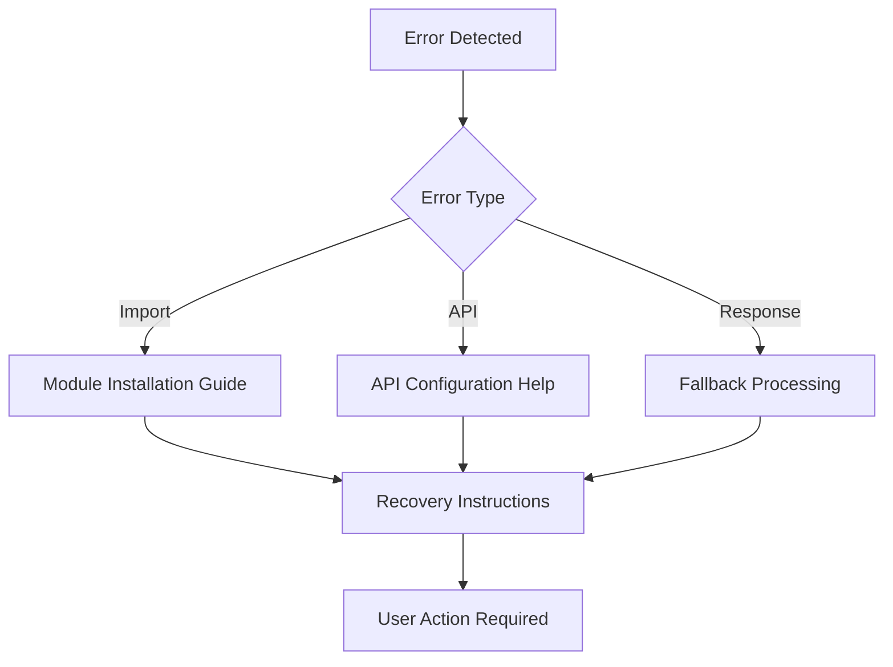

# 📋 a00_responses_api.py 設計書

## 📝 目次

1. [📖 概要書](#📖-概要書)
2. [🔧 システム構成](#🔧-システム構成)
3. [📋 関数一覧](#📋-関数一覧)
4. [📑 関数詳細設計](#📑-関数詳細設計)
5. [⚙️ 技術仕様](#⚙️-技術仕様)
6. [🚨 エラーハンドリング](#🚨-エラーハンドリング)

---

## 📖 概要書

### 🎯 処理の概要

**Anthropic API 統合デモアプリケーション**

本アプリケーションは、Anthropic Claude APIの基本機能を体験できるStreamlit Webアプリケーションです。基本的なテキスト生成から会話履歴管理まで、Claude APIの中核機能を2つの統合デモで学習・体験できます。

#### 🌟 主要機能

| 機能 | 説明 |
|------|------|
| 🤖 **テキスト応答** | ワンショット対話システム（単発質問応答） |
| 🧠 **メモリ応答** | 会話履歴保持による文脈認識対話 |
| ⚙️ **統一設定** | モデル横断的な設定管理と制御 |
| 📊 **使用状況追跡** | トークン使用量とコスト推定 |
| 🎨 **統一UI** | 一貫性のあるユーザーインターフェース |

#### 🎨 処理対象データ



### 🔄 mainの処理の流れ



---

## 🔧 システム構成

### 📦 主要コンポーネント



### 📋 データフロー



---

## 📋 関数一覧

### 🏗️ アプリケーション制御関数

| 関数名 | 分類 | 処理概要 | 重要度 |
|--------|------|----------|---------|
| `main()` | 🎯 制御 | アプリケーションエントリーポイント | ⭐⭐⭐ |
| `DemoManager.__init__()` | 🔧 初期化 | デモマネージャー初期化 | ⭐⭐⭐ |
| `DemoManager.run_application()` | 🎯 制御 | デモ統合管理・実行制御 | ⭐⭐⭐ |
| `DemoManager.setup_sidebar()` | 🎨 UI | サイドバー設定・デモ選択UI | ⭐⭐⭐ |

### 🏭 抽象基底クラス関数

| 関数名 | 分類 | 処理概要 | 重要度 |
|--------|------|----------|---------|
| `BaseDemo.__init__()` | 🔧 初期化 | デモ基盤初期化・クライアント設定 | ⭐⭐⭐ |
| `BaseDemo.run()` | 🎯 制御 | 抽象デモ実行メソッド | ⭐⭐⭐ |
| `BaseDemo.get_default_messages()` | 📝 構築 | デフォルトシステムメッセージ構築 | ⭐⭐ |
| `BaseDemo.call_api_unified()` | 🔌 API | 統一API呼び出しインターフェース | ⭐⭐⭐ |
| `BaseDemo.error_handler_ui()` | 🛡️ 保護 | UI統合エラーハンドリング | ⭐⭐⭐ |
| `BaseDemo.timer_ui()` | 📊 計測 | 実行時間計測デコレータ | ⭐⭐ |

### 🤖 デモ実装関数

#### TextResponseDemo
| 関数名 | 分類 | 処理概要 | 重要度 |
|--------|------|----------|---------|
| `TextResponseDemo.run()` | 🎯 実行 | テキスト応答デモ実行 | ⭐⭐⭐ |

#### MemoryResponseDemo  
| 関数名 | 分類 | 処理概要 | 重要度 |
|--------|------|----------|---------|
| `MemoryResponseDemo.run()` | 🎯 実行 | 記憶対応対話デモ実行 | ⭐⭐⭐ |

---

## 📑 関数詳細設計

### 🎯 main()

#### 🎯 処理概要
アプリケーション全体のエントリーポイント・初期化・実行制御

#### 📊 処理の流れ


#### 📋 IPO設計

| 項目 | 内容 |
|------|------|
| **INPUT** | 環境変数 (`ANTHROPIC_API_KEY`)、設定ファイル (`config.yml`) |
| **PROCESS** | 初期化 → 検証 → DemoManager作成 → アプリ実行 |
| **OUTPUT** | Streamlit Webアプリケーション起動 |

---

### 🏗️ BaseDemo (抽象基底クラス)

#### 🎯 処理概要
全デモの共通基盤・統一インターフェース・エラーハンドリング提供

#### 📊 処理の流れ


#### 📋 IPO設計

| 項目 | 内容 |
|------|------|
| **INPUT** | `demo_name: str`、Anthropic APIキー |
| **PROCESS** | クライアント初期化 → ヘルパー設定 → デコレータ適用 |
| **OUTPUT** | 統一されたデモ実行基盤 |

---

### 🔌 call_api_unified()

#### 🎯 処理概要
統一API呼び出しインターフェース・モデル固有設定処理

#### 📊 処理の流れ


#### 📋 IPO設計

| 項目 | 内容 |
|------|------|
| **INPUT** | メッセージリスト、モデル名、温度、最大トークン数 |
| **PROCESS** | パラメータ構築 → API呼び出し → 応答処理 → コスト計算 |
| **OUTPUT** | API応答、トークン使用量、推定コスト |

---

### 🤖 TextResponseDemo.run()

#### 🎯 処理概要
基本的なテキスト応答デモ・ワンショット対話実装

#### 📊 処理の流れ


#### 📋 IPO設計

| 項目 | 内容 |
|------|------|
| **INPUT** | ユーザークエリ、モデル選択、温度設定 |
| **PROCESS** | メッセージ構築 → 統一API呼び出し → 応答処理 |
| **OUTPUT** | AI生成テキスト応答、実行統計 |

---

### 🧠 MemoryResponseDemo.run()

#### 🎯 処理概要
会話履歴管理・文脈保持対話システム実装

#### 📊 処理の流れ


#### 📋 IPO設計

| 項目 | 内容 |
|------|------|
| **INPUT** | 連続対話入力、会話履歴 |
| **PROCESS** | 履歴管理 → 文脈保持 → API呼び出し → 履歴更新 |
| **OUTPUT** | 文脈考慮済AI応答、更新済会話履歴 |

---

## ⚙️ 技術仕様

### 📦 依存ライブラリ

| ライブラリ | バージョン | 用途 | 重要度 |
|-----------|-----------|------|---------|
| `streamlit` | 最新 | 🎨 Web UIフレームワーク | ⭐⭐⭐ |
| `anthropic` | 最新 | 🤖 Anthropic Claude API SDK | ⭐⭐⭐ |
| `pyyaml` | 最新 | ⚙️ 設定ファイル読み込み | ⭐⭐ |
| `python-dotenv` | 最新 | 🔑 環境変数管理 | ⭐⭐ |

### 🗃️ モデル対応

#### 📋 対応モデルカテゴリ

```yaml
Model_Categories:
  flagship: ["claude-3-5-sonnet-20241022", "claude-3-5-haiku-20241022"]
  balanced: ["claude-3-opus-20240229", "claude-3-sonnet-20240229"]
  fast: ["claude-3-haiku-20240307"]
  vision: ["claude-3-5-sonnet-20241022", "claude-3-opus-20240229"]
  coding: ["claude-3-5-sonnet-20241022"]
```

#### ⚙️ モデル固有設定

```python
# 推論モデル判定
def is_reasoning_model(model: str) -> bool:
    # 現在のClaudeモデルは推論モデルではない
    return False

# 温度設定（全モデル対応）
api_params = {
    "model": selected_model,
    "temperature": temperature,
    "max_tokens": max_tokens
}
```

### 🔄 API統合パターン

#### 📋 統一API呼び出し

```python
# メッセージ構築パターン
messages = self.get_default_messages()
messages.append({
    "role": "user", 
    "content": user_input
})

# 統一API呼び出し
response = self.call_api_unified(
    messages=messages,
    model=selected_model,
    temperature=temperature,
    max_tokens=max_tokens
)
```

### 💾 セッション管理

#### 🗂️ セッション状態構造

```python
session_state_structure = {
    "conversation_history": "List[Dict]",
    "selected_model": "str", 
    "temperature": "float",
    "max_tokens": "int",
    "total_tokens": "int",
    "total_cost": "float"
}
```

---

## 🚨 エラーハンドリング

### 📄 エラー分類

| エラー種別 | 原因 | 対処法 | 影響度 |
|-----------|------|--------|---------|
| **インポートエラー** | 🚫 モジュール不在 | インストール指示・依存関係確認 | 🔴 高 |
| **API認証エラー** | 🔑 無効なAPIキー | API キー設定方法表示 | 🔴 高 |
| **API呼び出しエラー** | 🌐 レート制限・通信問題 | リトライ提案・制限説明 | 🟡 中 |
| **モデル選択エラー** | 🤖 無効なモデル | デフォルトモデル復帰 | 🟡 中 |
| **JSON解析エラー** | 📄 不正な応答形式 | テキスト応答フォールバック | 🟠 低 |

### 🛠️ デコレータベースエラー処理

```python
@error_handler_ui
@timer_ui  
def run(self):
    # デモ実装
```

### 🎨 エラー表示パターン

```python
# 段階的エラー表示
st.error("❌ エラーが発生しました")
st.warning("⚠️ 設定を確認してください")  
st.info("💡 解決策: ...")
st.code("# 設定例\nANTHROPIC_API_KEY='your-key'")
```

### 🔄 エラー復旧フロー



---

## 🎉 まとめ

この設計書は、**a00_responses_api.py** の包括的な技術仕様と実装詳細を網羅した完全ドキュメントです。

### 🌟 設計のハイライト

- **🏗️ オブジェクト指向設計**: 抽象基底クラスによる統一インターフェース
- **🤖 Anthropic API統合**: Claude APIの基本機能を実装
- **🎨 直感的UI**: Streamlitによる使いやすいWebインターフェース
- **🛡️ 堅牢性**: デコレータベースの統一エラーハンドリング
- **⚙️ 柔軟な設定**: YAMLベースの設定管理

### 🔧 アーキテクチャ特徴

- **📦 モジュール分離**: BaseDemo抽象クラスによる共通機能統合
- **🔄 統一API**: 全デモで共通のAPI呼び出しパターン
- **💾 セッション管理**: Streamlitセッション状態の効率的活用
- **📊 コスト追跡**: トークン使用量とコスト推定機能