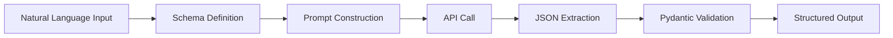
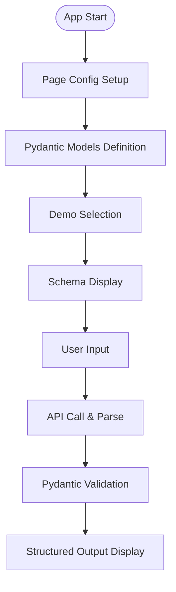
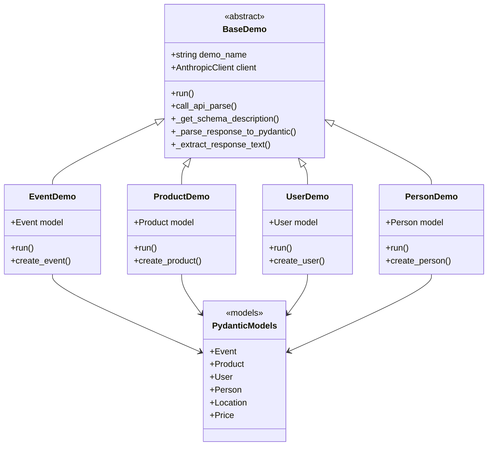
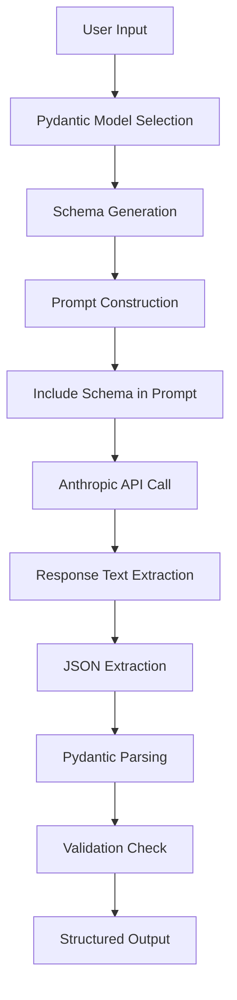
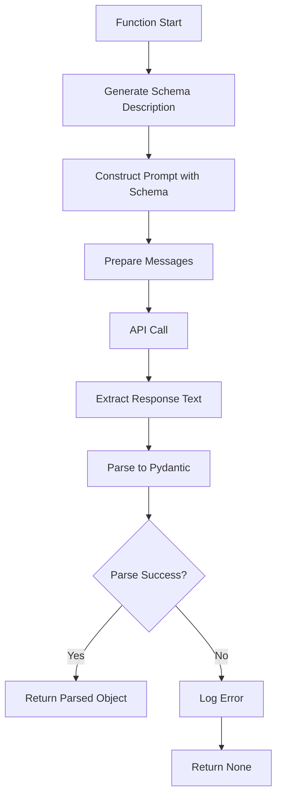
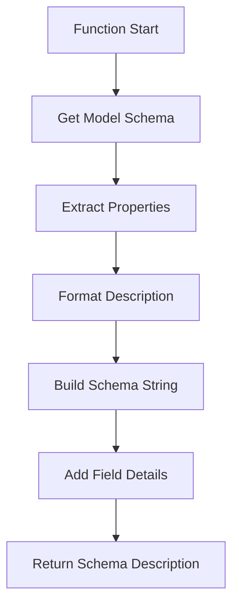
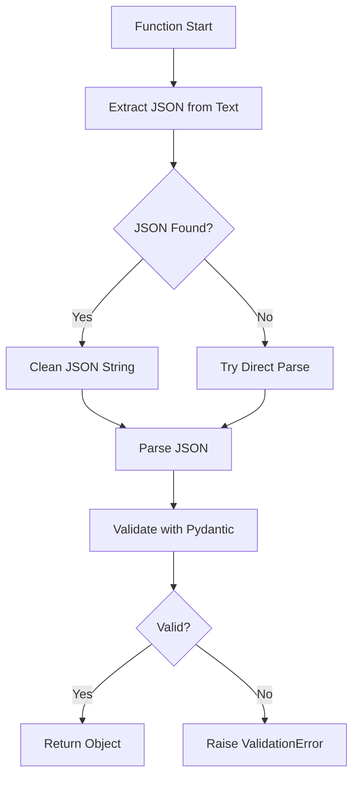
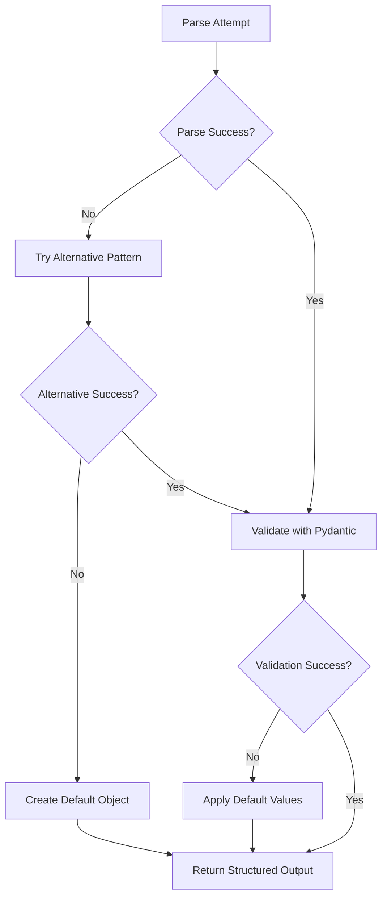

# 📋 a01_structured_outputs_parse_schema.py 設計書

## 📝 目次

1. [📖 概要書](#📖-概要書)
2. [🔧 システム構成](#🔧-システム構成)
3. [📋 関数一覧](#📋-関数一覧)
4. [📑 関数詳細設計](#📑-関数詳細設計)
5. [⚙️ 技術仕様](#⚙️-技術仕様)
6. [🚨 エラーハンドリング](#🚨-エラーハンドリング)

---

## 📖 概要書

### 🎯 処理の概要

**Anthropic API 構造化出力デモアプリケーション**

本アプリケーションは、Anthropic Claude APIを使用した構造化出力（Structured Outputs）とPydanticスキーマ検証を実装したStreamlit Webアプリケーションです。自然言語入力を型安全なJSON構造に変換し、複雑なデータ構造の生成と検証を実現します。

#### 🌟 主要機能

| 機能 | 説明 |
|------|------|
| 📊 **構造化出力** | Pydanticモデルによる型安全なJSON生成 |
| 🔍 **スキーマ検証** | 自動スキーマ生成と応答検証 |
| 🎯 **複数モデル対応** | Event、Product、Userなど多様なデータモデル |
| 📝 **プロンプト最適化** | スキーマ記述を含むプロンプト自動生成 |
| ⚙️ **エラーハンドリング** | JSON解析とPydantic検証の堅牢な処理 |

#### 🎨 処理対象データ



### 🔄 mainの処理の流れ



---

## 🔧 システム構成

### 📦 主要コンポーネント



### 📋 データフロー



---

## 📋 関数一覧

### 🏗️ 基底クラス関数

| 関数名 | 分類 | 処理概要 | 重要度 |
|--------|------|----------|---------|
| `BaseDemo.__init__()` | 🔧 初期化 | デモ基盤初期化・クライアント設定 | ⭐⭐⭐ |
| `BaseDemo.call_api_parse()` | 🔌 API | 構造化出力API呼び出し | ⭐⭐⭐ |
| `BaseDemo._get_schema_description()` | 📊 変換 | Pydanticモデル→JSONスキーマ変換 | ⭐⭐⭐ |
| `BaseDemo._parse_response_to_pydantic()` | 🔍 解析 | API応答→Pydanticオブジェクト変換 | ⭐⭐⭐ |
| `BaseDemo._extract_response_text()` | 📝 抽出 | 応答からテキスト抽出 | ⭐⭐ |

### 🎯 Pydanticモデル定義

| モデル名 | 分類 | フィールド構成 | 重要度 |
|---------|------|--------------|---------|
| `Event` | 📅 イベント | name, date, participants, location | ⭐⭐⭐ |
| `Product` | 📦 商品 | name, category, price, features | ⭐⭐⭐ |
| `User` | 👤 ユーザー | username, email, full_name, age | ⭐⭐⭐ |
| `Person` | 🧑 人物 | name, age, email, skills | ⭐⭐⭐ |
| `Location` | 📍 場所 | city, country, venue (Event用) | ⭐⭐ |
| `Price` | 💰 価格 | amount, currency (Product用) | ⭐⭐ |

### 🤖 デモ実装関数

| 関数名 | 分類 | 処理概要 | 重要度 |
|--------|------|----------|---------|
| `EventDemo.run()` | 🎯 実行 | イベント構造化出力デモ | ⭐⭐⭐ |
| `ProductDemo.run()` | 🎯 実行 | 商品構造化出力デモ | ⭐⭐⭐ |
| `UserDemo.run()` | 🎯 実行 | ユーザー構造化出力デモ | ⭐⭐⭐ |
| `PersonDemo.run()` | 🎯 実行 | 人物構造化出力デモ | ⭐⭐⭐ |

---

## 📑 関数詳細設計

### 🔌 call_api_parse()

#### 🎯 処理概要
Pydanticモデルを使用した構造化出力API呼び出しと解析

#### 📊 処理の流れ


#### 📋 IPO設計

| 項目 | 内容 |
|------|------|
| **INPUT** | `prompt: str`, `pydantic_model: Type[BaseModel]`, `model: str`, `temperature: float` |
| **PROCESS** | スキーマ生成 → プロンプト構築 → API呼び出し → 解析 |
| **OUTPUT** | `Tuple[Optional[BaseModel], Optional[Dict]]` (解析済オブジェクト, API応答) |

---

### 📊 _get_schema_description()

#### 🎯 処理概要
PydanticモデルからJSONスキーマ記述を生成

#### 📊 処理の流れ


#### 📋 IPO設計

| 項目 | 内容 |
|------|------|
| **INPUT** | `pydantic_model: Type[BaseModel]` |
| **PROCESS** | スキーマ取得 → プロパティ抽出 → フォーマット |
| **OUTPUT** | `str` (JSON スキーマ記述) |

---

### 🔍 _parse_response_to_pydantic()

#### 🎯 処理概要
API応答テキストをPydanticモデルに変換

#### 📊 処理の流れ


#### 📋 IPO設計

| 項目 | 内容 |
|------|------|
| **INPUT** | `response_text: str`, `pydantic_model: Type[BaseModel]` |
| **PROCESS** | JSON抽出 → クリーニング → 解析 → 検証 |
| **OUTPUT** | `BaseModel` (検証済Pydanticオブジェクト) |

---

### 📅 Event モデル

#### 🎯 処理概要
イベント情報を構造化するPydanticモデル

#### 📊 データ構造
```python
class Location(BaseModel):
    city: str
    country: str
    venue: Optional[str] = None

class Event(BaseModel):
    name: str
    date: str
    participants: List[str]
    location: Location
```

#### 📋 フィールド仕様

| フィールド | 型 | 説明 | 必須 |
|-----------|---|------|------|
| `name` | `str` | イベント名 | ✓ |
| `date` | `str` | 開催日 | ✓ |
| `participants` | `List[str]` | 参加者リスト | ✓ |
| `location` | `Location` | 開催場所 | ✓ |

---

### 📦 Product モデル

#### 🎯 処理概要
商品情報を構造化するPydanticモデル

#### 📊 データ構造
```python
class Price(BaseModel):
    amount: float
    currency: str = "USD"

class Product(BaseModel):
    name: str
    category: str
    price: Price
    features: List[str]
    in_stock: bool = True
```

#### 📋 フィールド仕様

| フィールド | 型 | 説明 | 必須 |
|-----------|---|------|------|
| `name` | `str` | 商品名 | ✓ |
| `category` | `str` | カテゴリ | ✓ |
| `price` | `Price` | 価格情報 | ✓ |
| `features` | `List[str]` | 特徴リスト | ✓ |
| `in_stock` | `bool` | 在庫状況 | ✗ |

---

## ⚙️ 技術仕様

### 📦 依存ライブラリ

| ライブラリ | バージョン | 用途 | 重要度 |
|-----------|-----------|------|---------|
| `streamlit` | 最新 | 🎨 Web UIフレームワーク | ⭐⭐⭐ |
| `anthropic` | 最新 | 🤖 Anthropic Claude API SDK | ⭐⭐⭐ |
| `pydantic` | 2.0+ | 📊 データ検証・構造化 | ⭐⭐⭐ |
| `typing` | 標準 | 🔍 型ヒント | ⭐⭐ |

### 🔄 JSON抽出パターン

#### 📋 複数の抽出戦略

```python
# パターン1: コードブロック内のJSON
```json
{
    "key": "value"
}
```

# パターン2: 直接JSON
{"key": "value"}

# パターン3: テキスト混在
Here is the JSON: {"key": "value"}
```

#### 🔍 抽出アルゴリズム

```python
def extract_json(text: str) -> dict:
    # 1. コードブロック検索
    if "```json" in text:
        json_str = extract_from_code_block(text)
    # 2. 波括弧検索
    elif "{" in text and "}" in text:
        json_str = extract_between_braces(text)
    # 3. 直接解析試行
    else:
        json_str = text
    
    return json.loads(json_str)
```

### 💾 プロンプトエンジニアリング

#### 🗂️ スキーマ埋め込みパターン

```python
prompt_template = """
{user_request}

Please provide your response as a JSON object that matches this schema:
{schema_description}

Important: Return ONLY valid JSON, no additional text.
"""
```

#### 📊 スキーマ記述フォーマット

```json
{
    "name": "string (required)",
    "age": "integer (required)",
    "email": "string (optional)",
    "skills": "array of strings (required)"
}
```

---

## 🚨 エラーハンドリング

### 📄 エラー分類

| エラー種別 | 原因 | 対処法 | 影響度 |
|-----------|------|--------|---------|
| **JSON解析エラー** | 📄 不正なJSON形式 | 複数パターンで再試行 | 🟡 中 |
| **Pydantic検証エラー** | 🔍 スキーマ不一致 | エラー詳細表示・再生成 | 🟡 中 |
| **API応答エラー** | 🌐 空応答・タイムアウト | デフォルト値返却 | 🟡 中 |
| **型変換エラー** | 🔄 型不一致 | 型強制変換試行 | 🟠 低 |
| **ネストエラー** | 🏗️ 深いネスト構造 | 段階的解析 | 🟠 低 |

### 🛠️ エラー処理戦略

```python
try:
    # JSON解析試行
    parsed = parse_json(response)
except JSONDecodeError:
    # フォールバック1: コードブロック抽出
    try:
        parsed = extract_from_code_block(response)
    except:
        # フォールバック2: 部分文字列検索
        parsed = extract_json_substring(response)

try:
    # Pydantic検証
    validated = PydanticModel(**parsed)
except ValidationError as e:
    # エラー詳細ログ
    log_validation_error(e)
    # デフォルト値での再試行
    validated = create_with_defaults(parsed)
```

### 🎨 エラー表示パターン

```python
# ユーザーフレンドリーなエラー表示
if error_type == "json_parse":
    st.error("❌ JSON解析エラー: 応答形式が不正です")
    st.info("💡 再度実行するか、プロンプトを調整してください")
elif error_type == "validation":
    st.warning("⚠️ データ検証エラー")
    st.code(validation_errors, language="json")
```

### 🔄 エラー復旧フロー



---

## 🎉 まとめ

この設計書は、**a01_structured_outputs_parse_schema.py** の包括的な技術仕様と実装詳細を網羅した完全ドキュメントです。

### 🌟 設計のハイライト

- **📊 型安全性**: Pydanticによる厳密な型検証
- **🔍 堅牢な解析**: 複数のJSON抽出パターン対応
- **🎯 スキーマ駆動**: モデル定義による自動スキーマ生成
- **🛡️ エラー耐性**: 多層的なエラーハンドリング
- **⚙️ 拡張性**: 新規モデルの容易な追加

### 🔧 アーキテクチャ特徴

- **📦 モデル分離**: データモデルとロジックの明確な分離
- **🔄 再利用性**: 基底クラスによる共通処理の統合
- **💾 検証フロー**: 段階的な検証と復旧メカニズム
- **🎨 UI統合**: Streamlitとの seamless な統合