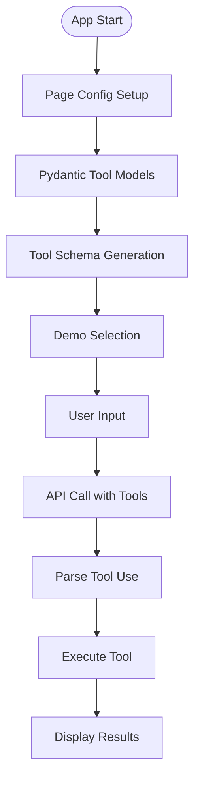
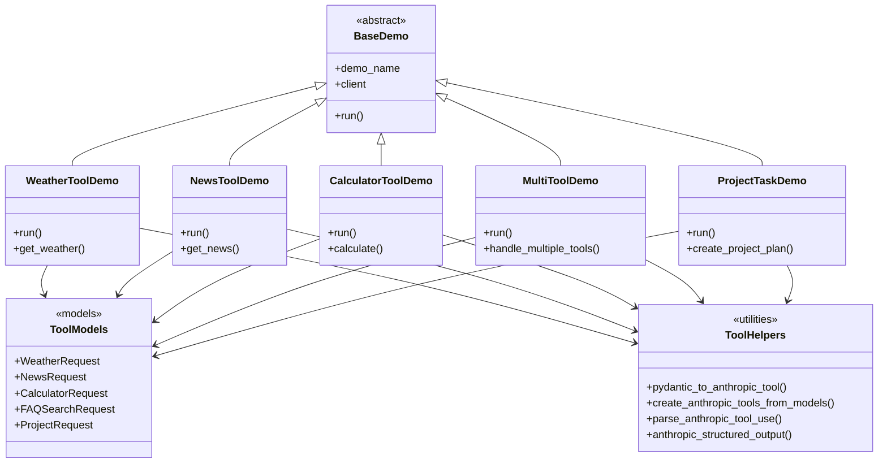
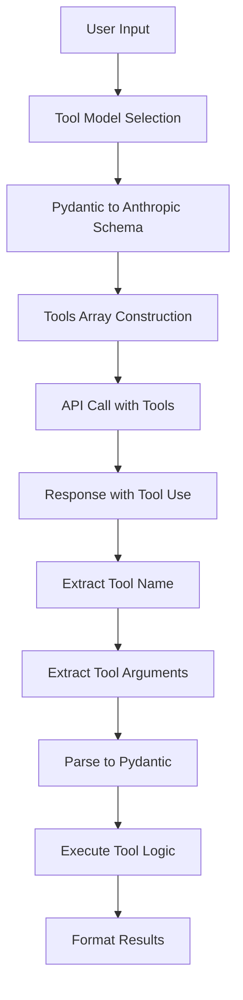
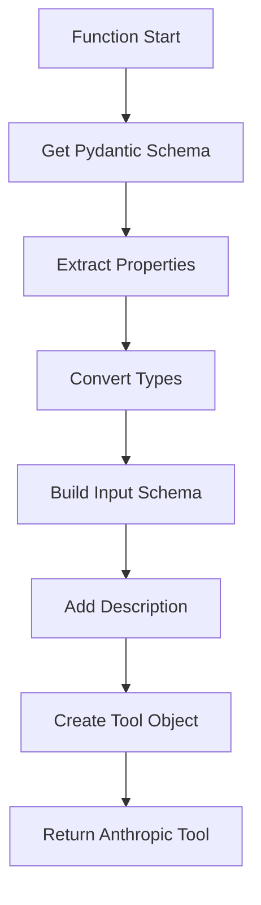
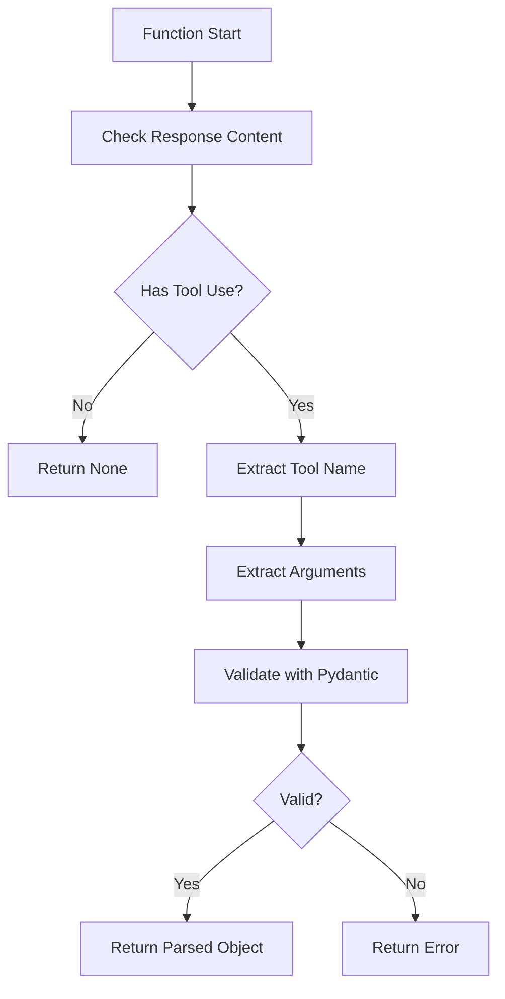
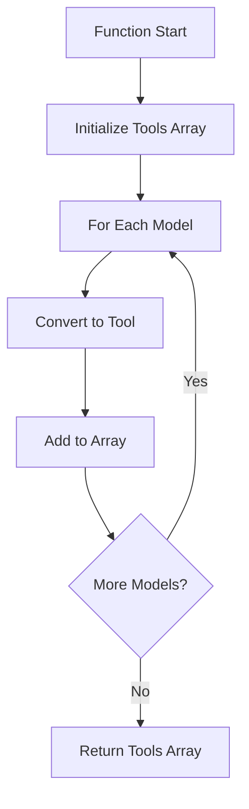
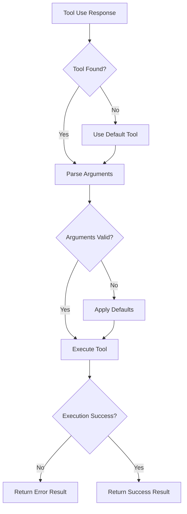

# 📋 a02_responses_tools_pydantic_parse.py 設計書

## 📝 目次

1. [📖 概要書](#📖-概要書)
2. [🔧 システム構成](#🔧-システム構成)
3. [📋 関数一覧](#📋-関数一覧)
4. [📑 関数詳細設計](#📑-関数詳細設計)
5. [⚙️ 技術仕様](#⚙️-技術仕様)
6. [🚨 エラーハンドリング](#🚨-エラーハンドリング)

---

## 📖 概要書

### 🎯 処理の概要

**Anthropic API ツール使用（Function Calling）デモアプリケーション**

本アプリケーションは、Anthropic Claude APIのツール使用機能（Function Calling）を実装したStreamlit Webアプリケーションです。Pydanticモデルを使用して複数のツール定義を作成し、AIが適切なツールを選択して実行する高度な対話システムを実現します。

#### 🌟 主要機能

| 機能 | 説明 |
|------|------|
| 🔧 **ツール定義** | Pydanticモデルからツールスキーマ自動生成 |
| 🤖 **ツール選択** | AIによる適切なツールの自動選択 |
| 📊 **構造化引数** | 型安全なツール引数の解析と検証 |
| 🔄 **マルチツール** | 複数ツールの同時定義と選択 |
| 🏗️ **複雑な構造** | ネストされたデータ構造のサポート |

#### 🎨 処理対象データ


### 🔄 mainの処理の流れ



---

## 🔧 システム構成

### 📦 主要コンポーネント



### 📋 データフロー



---

## 📋 関数一覧

### 🔧 ツール変換関数

| 関数名 | 分類 | 処理概要 | 重要度 |
|--------|------|----------|---------|
| `pydantic_to_anthropic_tool()` | 🔄 変換 | PydanticモデルをAnthropicツール形式に変換 | ⭐⭐⭐ |
| `create_anthropic_tools_from_models()` | 🏗️ 構築 | 複数モデルからツール配列生成 | ⭐⭐⭐ |
| `parse_anthropic_tool_use()` | 🔍 解析 | ツール使用応答の解析 | ⭐⭐⭐ |
| `anthropic_structured_output()` | 📊 出力 | 構造化出力の実装 | ⭐⭐⭐ |

### 🎯 Pydanticツールモデル

| モデル名 | 分類 | パラメータ | 重要度 |
|---------|------|-----------|---------|
| `WeatherRequest` | 🌤️ 天気 | location, units | ⭐⭐⭐ |
| `NewsRequest` | 📰 ニュース | topic, category, limit | ⭐⭐⭐ |
| `CalculatorRequest` | 🧮 計算 | operation, a, b | ⭐⭐⭐ |
| `FAQSearchRequest` | 🔍 FAQ | query, category | ⭐⭐ |
| `ProjectRequest` | 📋 プロジェクト | name, description, tasks | ⭐⭐⭐ |
| `Task` | 📝 タスク | title, description, priority | ⭐⭐ |

### 🤖 デモ実装関数

| 関数名 | 分類 | 処理概要 | 重要度 |
|--------|------|----------|---------|
| `WeatherToolDemo.run()` | 🎯 実行 | 天気情報取得ツールデモ | ⭐⭐⭐ |
| `NewsToolDemo.run()` | 🎯 実行 | ニュース取得ツールデモ | ⭐⭐⭐ |
| `CalculatorToolDemo.run()` | 🎯 実行 | 計算ツールデモ | ⭐⭐ |
| `MultiToolDemo.run()` | 🎯 実行 | 複数ツール選択デモ | ⭐⭐⭐ |
| `ProjectTaskDemo.run()` | 🎯 実行 | プロジェクト計画生成デモ | ⭐⭐⭐ |

---

## 📑 関数詳細設計

### 🔄 pydantic_to_anthropic_tool()

#### 🎯 処理概要
PydanticモデルをAnthropicのツール形式に変換

#### 📊 処理の流れ


#### 📋 IPO設計

| 項目 | 内容 |
|------|------|
| **INPUT** | `model: Type[BaseModel]`, `name: str`, `description: str` |
| **PROCESS** | スキーマ取得 → 型変換 → ツール形式構築 |
| **OUTPUT** | `Dict` (Anthropicツール定義) |

#### 💻 実装例

```python
def pydantic_to_anthropic_tool(model, name, description):
    schema = model.model_json_schema()
    
    return {
        "name": name,
        "description": description,
        "input_schema": {
            "type": "object",
            "properties": schema.get("properties", {}),
            "required": schema.get("required", [])
        }
    }
```

---

### 🔍 parse_anthropic_tool_use()

#### 🎯 処理概要
Anthropic APIのツール使用応答を解析

#### 📊 処理の流れ


#### 📋 IPO設計

| 項目 | 内容 |
|------|------|
| **INPUT** | `response: Message`, `expected_model: Type[BaseModel]` |
| **PROCESS** | コンテンツ確認 → ツール抽出 → 引数解析 → 検証 |
| **OUTPUT** | `Optional[BaseModel]` (解析済みツール引数) |

---

### 🌤️ WeatherRequest モデル

#### 🎯 処理概要
天気情報取得用のツールパラメータモデル

#### 📊 データ構造
```python
class TemperatureUnit(str, Enum):
    CELSIUS = "celsius"
    FAHRENHEIT = "fahrenheit"

class WeatherRequest(BaseModel):
    location: str = Field(description="City name or coordinates")
    units: TemperatureUnit = Field(
        default=TemperatureUnit.CELSIUS,
        description="Temperature unit"
    )
```

#### 📋 フィールド仕様

| フィールド | 型 | 説明 | 必須 |
|-----------|---|------|------|
| `location` | `str` | 都市名または座標 | ✓ |
| `units` | `TemperatureUnit` | 温度単位 | ✗ |

---

### 📋 ProjectRequest モデル

#### 🎯 処理概要
プロジェクト計画生成用の複雑なツールモデル

#### 📊 データ構造
```python
class Priority(str, Enum):
    HIGH = "high"
    MEDIUM = "medium"
    LOW = "low"

class Task(BaseModel):
    title: str
    description: str
    priority: Priority
    estimated_hours: Optional[float] = None

class ProjectRequest(BaseModel):
    name: str
    description: str
    tasks: List[Task]
    deadline: Optional[str] = None
```

#### 📋 フィールド仕様

| フィールド | 型 | 説明 | 必須 |
|-----------|---|------|------|
| `name` | `str` | プロジェクト名 | ✓ |
| `description` | `str` | プロジェクト説明 | ✓ |
| `tasks` | `List[Task]` | タスクリスト | ✓ |
| `deadline` | `str` | 期限 | ✗ |

---

### 🔄 create_anthropic_tools_from_models()

#### 🎯 処理概要
複数のPydanticモデルからツール配列を生成

#### 📊 処理の流れ


#### 📋 IPO設計

| 項目 | 内容 |
|------|------|
| **INPUT** | `models: List[Tuple[Type[BaseModel], str, str]]` |
| **PROCESS** | モデルリスト反復 → 各モデル変換 → 配列構築 |
| **OUTPUT** | `List[Dict]` (Anthropicツール定義配列) |

---

## ⚙️ 技術仕様

### 📦 依存ライブラリ

| ライブラリ | バージョン | 用途 | 重要度 |
|-----------|-----------|------|---------|
| `streamlit` | 最新 | 🎨 Web UIフレームワーク | ⭐⭐⭐ |
| `anthropic` | 最新 | 🤖 Anthropic Claude API SDK | ⭐⭐⭐ |
| `pydantic` | 2.0+ | 📊 データ検証・スキーマ生成 | ⭐⭐⭐ |
| `enum` | 標準 | 🔄 列挙型定義 | ⭐⭐ |

### 🔧 ツール定義フォーマット

#### 📋 Anthropicツール形式

```json
{
    "name": "get_weather",
    "description": "Get weather information for a location",
    "input_schema": {
        "type": "object",
        "properties": {
            "location": {
                "type": "string",
                "description": "City name"
            },
            "units": {
                "type": "string",
                "enum": ["celsius", "fahrenheit"],
                "default": "celsius"
            }
        },
        "required": ["location"]
    }
}
```

### 🤖 API呼び出しパターン

#### 📊 ツール付きAPI呼び出し

```python
# ツール定義
tools = create_anthropic_tools_from_models([
    (WeatherRequest, "get_weather", "Get weather info"),
    (NewsRequest, "get_news", "Get latest news")
])

# API呼び出し
response = client.messages.create(
    model=model,
    messages=messages,
    tools=tools,
    tool_choice="auto"  # or "any", "none", {"type": "tool", "name": "get_weather"}
)

# ツール使用解析
for content in response.content:
    if content.type == "tool_use":
        tool_name = content.name
        tool_input = content.input
        # ツール実行ロジック
```

### 💾 ツール選択戦略

#### 🗂️ tool_choice オプション

| オプション | 説明 | 使用場面 |
|-----------|------|----------|
| `"auto"` | AIが自動選択 | 一般的な対話 |
| `"any"` | 必ずツールを使用 | ツール実行が必須の場合 |
| `"none"` | ツールを使用しない | テキスト応答のみ必要な場合 |
| `{"type": "tool", "name": "..."}` | 特定ツール強制 | 特定機能の実行 |

---

## 🚨 エラーハンドリング

### 📄 エラー分類

| エラー種別 | 原因 | 対処法 | 影響度 |
|-----------|------|--------|---------|
| **スキーマ変換エラー** | 🔄 不正なPydanticモデル | スキーマ検証・修正 | 🔴 高 |
| **ツール選択エラー** | 🤖 未定義ツールの選択 | デフォルトツール使用 | 🟡 中 |
| **引数解析エラー** | 📊 型不一致・必須項目欠落 | デフォルト値適用 | 🟡 中 |
| **ツール実行エラー** | 🔧 実行時エラー | エラーメッセージ返却 | 🟡 中 |
| **複数ツールエラー** | 🔄 同時実行の競合 | 順次実行に切り替え | 🟠 低 |

### 🛠️ エラー処理戦略

```python
def safe_tool_execution(tool_use, model_class):
    try:
        # ツール引数解析
        args = model_class(**tool_use.input)
    except ValidationError as e:
        # 検証エラー処理
        return {
            "error": "Invalid arguments",
            "details": str(e)
        }
    
    try:
        # ツール実行
        result = execute_tool(args)
    except Exception as e:
        # 実行エラー処理
        return {
            "error": "Execution failed",
            "details": str(e)
        }
    
    return result
```

### 🎨 エラー表示パターン

```python
# ツールエラーの段階的表示
if error_type == "schema_conversion":
    st.error("❌ ツールスキーマ変換エラー")
    st.code(schema_error, language="json")
elif error_type == "tool_not_found":
    st.warning("⚠️ 指定されたツールが見つかりません")
    st.info(f"利用可能なツール: {available_tools}")
elif error_type == "argument_validation":
    st.error("❌ ツール引数検証エラー")
    with st.expander("エラー詳細"):
        st.json(validation_errors)
```

### 🔄 エラー復旧フロー



---

## 🎉 まとめ

この設計書は、**a02_responses_tools_pydantic_parse.py** の包括的な技術仕様と実装詳細を網羅した完全ドキュメントです。

### 🌟 設計のハイライト

- **🔧 動的ツール生成**: Pydanticモデルからの自動ツール定義
- **🤖 インテリジェント選択**: AIによる適切なツール選択
- **📊 型安全性**: Pydantic検証による堅牢な引数処理
- **🔄 マルチツール対応**: 複数ツールの同時定義と実行
- **🏗️ 複雑な構造**: ネストされたデータ構造のサポート

### 🔧 アーキテクチャ特徴

- **📦 モデル駆動**: Pydanticモデル中心の設計
- **🔄 変換レイヤー**: OpenAI形式からAnthropic形式への変換
- **💾 拡張性**: 新規ツールの容易な追加
- **🎨 UI統合**: Streamlitとの seamless な統合