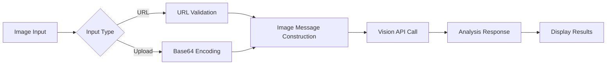
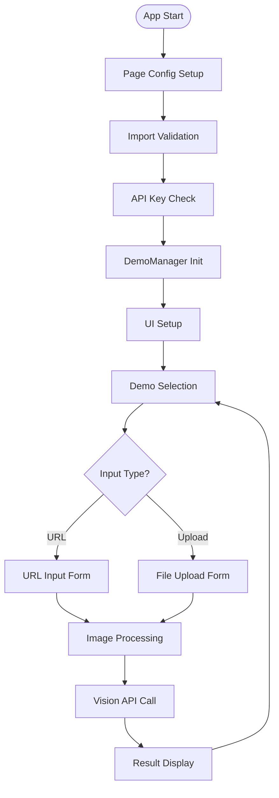
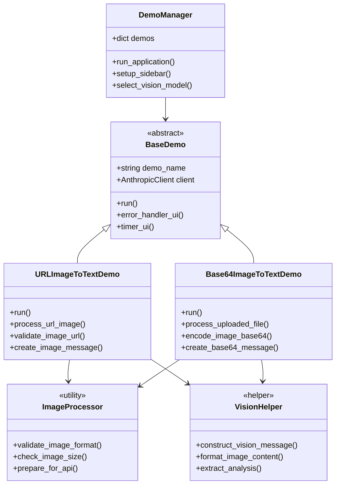
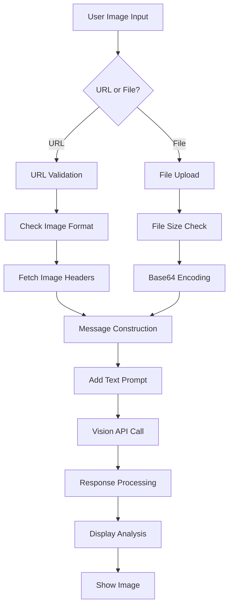
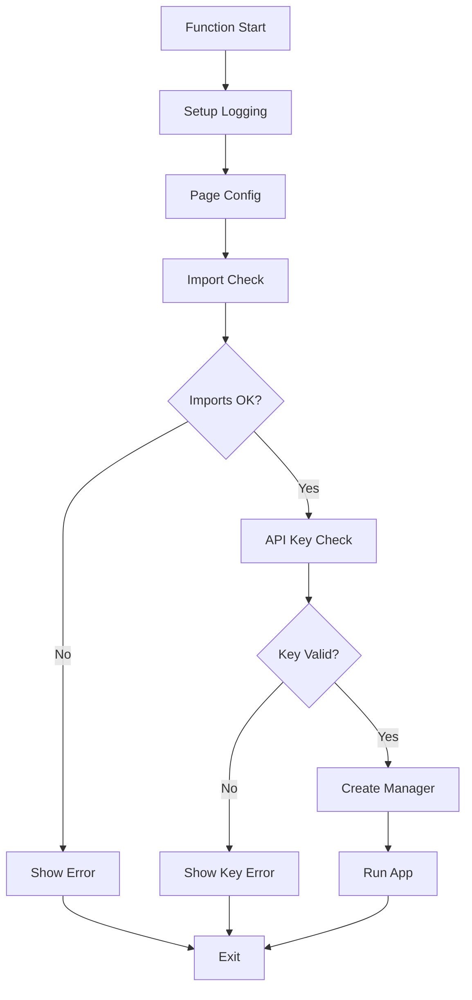
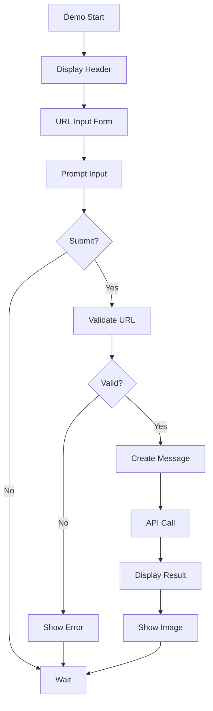
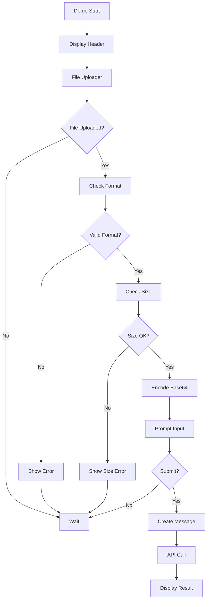
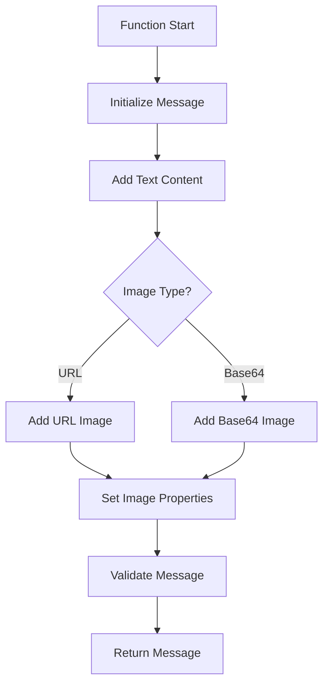
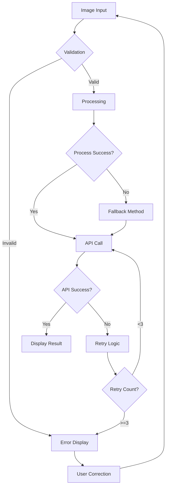

# 📋 a03_images_and_vision.py 設計書

## 📝 目次

1. [📖 概要書](#📖-概要書)
2. [🔧 システム構成](#🔧-システム構成)
3. [📋 関数一覧](#📋-関数一覧)
4. [📑 関数詳細設計](#📑-関数詳細設計)
5. [⚙️ 技術仕様](#⚙️-技術仕様)
6. [🚨 エラーハンドリング](#🚨-エラーハンドリング)

---

## 📖 概要書

### 🎯 処理の概要

**Anthropic Claude Vision API デモアプリケーション**

本アプリケーションは、Anthropic Claude APIのビジョン機能を活用したStreamlit Webアプリケーションです。画像をURLまたはBase64エンコード形式で入力し、AIによる画像分析・説明・質問応答を実現するマルチモーダル対話システムを提供します。

#### 🌟 主要機能

| 機能 | 説明 |
|------|------|
| 🖼️ **URL画像処理** | Web上の画像URLから直接分析 |
| 📤 **ファイルアップロード** | ローカル画像のBase64処理と分析 |
| 🔍 **画像分析** | 画像内容の詳細な説明と解釈 |
| 💬 **質問応答** | 画像に関する質問への回答 |
| 🎨 **マルチフォーマット** | JPG、PNG、WebP、GIF対応 |

#### 🎨 処理対象データ



### 🔄 mainの処理の流れ



---

## 🔧 システム構成

### 📦 主要コンポーネント



### 📋 データフロー



---

## 📋 関数一覧

### 🏗️ アプリケーション制御関数

| 関数名 | 分類 | 処理概要 | 重要度 |
|--------|------|----------|---------|
| `main()` | 🎯 制御 | アプリケーションエントリーポイント | ⭐⭐⭐ |
| `DemoManager.__init__()` | 🔧 初期化 | デモマネージャー初期化 | ⭐⭐⭐ |
| `DemoManager.run_application()` | 🎯 制御 | デモ統合管理・実行制御 | ⭐⭐⭐ |
| `DemoManager.setup_sidebar()` | 🎨 UI | サイドバー設定・モデル選択 | ⭐⭐⭐ |

### 🏭 基底クラス関数

| 関数名 | 分類 | 処理概要 | 重要度 |
|--------|------|----------|---------|
| `BaseDemo.__init__()` | 🔧 初期化 | デモ基盤初期化・クライアント設定 | ⭐⭐⭐ |
| `BaseDemo.run()` | 🎯 制御 | 抽象デモ実行メソッド | ⭐⭐⭐ |
| `BaseDemo.error_handler_ui()` | 🛡️ 保護 | UI統合エラーハンドリング | ⭐⭐⭐ |
| `BaseDemo.timer_ui()` | 📊 計測 | 実行時間計測デコレータ | ⭐⭐ |

### 🖼️ URL画像処理関数

| 関数名 | 分類 | 処理概要 | 重要度 |
|--------|------|----------|---------|
| `URLImageToTextDemo.run()` | 🎯 実行 | URL画像デモ実行 | ⭐⭐⭐ |
| `URLImageToTextDemo.process_url_image()` | 🔍 処理 | URL画像の取得と処理 | ⭐⭐⭐ |
| `URLImageToTextDemo.validate_image_url()` | ✅ 検証 | 画像URL有効性確認 | ⭐⭐ |
| `URLImageToTextDemo.create_image_message()` | 📝 構築 | 画像メッセージ構築 | ⭐⭐⭐ |

### 📤 Base64画像処理関数

| 関数名 | 分類 | 処理概要 | 重要度 |
|--------|------|----------|---------|
| `Base64ImageToTextDemo.run()` | 🎯 実行 | Base64画像デモ実行 | ⭐⭐⭐ |
| `Base64ImageToTextDemo.process_uploaded_file()` | 🔍 処理 | アップロードファイル処理 | ⭐⭐⭐ |
| `Base64ImageToTextDemo.encode_image_base64()` | 🔄 変換 | Base64エンコーディング | ⭐⭐⭐ |
| `Base64ImageToTextDemo.create_base64_message()` | 📝 構築 | Base64メッセージ構築 | ⭐⭐⭐ |

---

## 📑 関数詳細設計

### 🎯 main()

#### 🎯 処理概要
アプリケーション全体のエントリーポイント・初期化・実行制御

#### 📊 処理の流れ


#### 📋 IPO設計

| 項目 | 内容 |
|------|------|
| **INPUT** | 環境変数 (`ANTHROPIC_API_KEY`)、設定ファイル |
| **PROCESS** | 初期化 → 検証 → DemoManager作成 → 実行 |
| **OUTPUT** | Streamlit Webアプリケーション |

---

### 🖼️ URLImageToTextDemo.run()

#### 🎯 処理概要
URL経由での画像入力と分析処理

#### 📊 処理の流れ


#### 📋 IPO設計

| 項目 | 内容 |
|------|------|
| **INPUT** | 画像URL、分析プロンプト、モデル選択 |
| **PROCESS** | URL検証 → メッセージ構築 → API呼び出し → 結果処理 |
| **OUTPUT** | 画像分析結果、元画像表示 |

---

### 📤 Base64ImageToTextDemo.run()

#### 🎯 処理概要
ファイルアップロードによる画像入力と分析処理

#### 📊 処理の流れ


#### 📋 IPO設計

| 項目 | 内容 |
|------|------|
| **INPUT** | 画像ファイル、分析プロンプト、モデル選択 |
| **PROCESS** | ファイル検証 → Base64変換 → メッセージ構築 → API呼び出し |
| **OUTPUT** | 画像分析結果、アップロード画像表示 |

---

### 🔄 create_image_message()

#### 🎯 処理概要
Vision API用のマルチモーダルメッセージ構築

#### 📊 処理の流れ


#### 📋 IPO設計

| 項目 | 内容 |
|------|------|
| **INPUT** | テキストプロンプト、画像データ（URL/Base64）、画像タイプ |
| **PROCESS** | コンテンツ配列構築 → 画像データ追加 → 検証 |
| **OUTPUT** | Vision APIメッセージオブジェクト |

---

## ⚙️ 技術仕様

### 📦 依存ライブラリ

| ライブラリ | バージョン | 用途 | 重要度 |
|-----------|-----------|------|---------|
| `streamlit` | 最新 | 🎨 Web UIフレームワーク | ⭐⭐⭐ |
| `anthropic` | 最新 | 🤖 Anthropic Claude API SDK | ⭐⭐⭐ |
| `base64` | 標準 | 🔄 画像エンコーディング | ⭐⭐⭐ |
| `PIL` | 最新 | 🖼️ 画像処理・検証 | ⭐⭐ |
| `requests` | 最新 | 🌐 URL画像取得 | ⭐⭐ |

### 🖼️ 対応画像フォーマット

| フォーマット | MIME Type | 最大サイズ | 備考 |
|------------|-----------|-----------|------|
| JPEG | `image/jpeg` | 20MB | 推奨フォーマット |
| PNG | `image/png` | 20MB | 透過対応 |
| WebP | `image/webp` | 20MB | 高圧縮率 |
| GIF | `image/gif` | 20MB | 静止画のみ |

### 🔄 メッセージ構造

#### 📋 Vision APIメッセージフォーマット

```python
# URL画像メッセージ
message = {
    "role": "user",
    "content": [
        {
            "type": "text",
            "text": "この画像を説明してください"
        },
        {
            "type": "image",
            "source": {
                "type": "url",
                "url": "https://example.com/image.jpg"
            }
        }
    ]
}

# Base64画像メッセージ
message = {
    "role": "user",
    "content": [
        {
            "type": "text",
            "text": "この画像を分析してください"
        },
        {
            "type": "image",
            "source": {
                "type": "base64",
                "media_type": "image/jpeg",
                "data": "base64_encoded_string"
            }
        }
    ]
}
```

### 💾 画像処理パイプライン

#### 🗂️ URL画像処理フロー

```python
def process_url_image(url: str) -> dict:
    # 1. URL検証
    validate_url(url)
    
    # 2. 画像ヘッダー確認
    headers = fetch_image_headers(url)
    validate_content_type(headers)
    
    # 3. サイズ確認
    check_content_length(headers)
    
    # 4. メッセージ構築
    return create_url_message(url)
```

#### 📤 Base64画像処理フロー

```python
def process_base64_image(file) -> dict:
    # 1. ファイル検証
    validate_file_format(file)
    
    # 2. サイズ確認
    check_file_size(file)
    
    # 3. Base64エンコード
    encoded = base64.b64encode(file.read())
    
    # 4. メッセージ構築
    return create_base64_message(encoded, file.type)
```

---

## 🚨 エラーハンドリング

### 📄 エラー分類

| エラー種別 | 原因 | 対処法 | 影響度 |
|-----------|------|--------|---------|
| **URL無効エラー** | 🌐 不正なURL形式 | URL形式確認・修正 | 🟡 中 |
| **画像取得エラー** | 📡 ネットワーク問題 | リトライ・URL確認 | 🟡 中 |
| **フォーマットエラー** | 🖼️ 非対応形式 | 対応形式に変換 | 🟡 中 |
| **サイズ超過エラー** | 📦 20MB超過 | 画像圧縮・リサイズ | 🟡 中 |
| **エンコードエラー** | 🔄 Base64変換失敗 | ファイル再読込 | 🟠 低 |
| **API制限エラー** | 🚫 レート制限 | 待機・リトライ | 🔴 高 |

### 🛠️ エラー処理戦略

```python
def safe_image_processing(image_input):
    try:
        # 画像検証
        validate_image(image_input)
    except ValidationError as e:
        st.error(f"❌ 画像検証エラー: {e}")
        return None
    
    try:
        # 画像処理
        processed = process_image(image_input)
    except ProcessingError as e:
        st.warning("⚠️ 処理エラー、別の方法を試行中...")
        processed = fallback_process(image_input)
    
    try:
        # API呼び出し
        result = call_vision_api(processed)
    except APIError as e:
        st.error(f"❌ API エラー: {e}")
        return None
    
    return result
```

### 🎨 エラー表示パターン

```python
# 段階的エラー表示
if error_type == "invalid_url":
    st.error("❌ 無効なURL形式です")
    st.info("💡 例: https://example.com/image.jpg")
elif error_type == "unsupported_format":
    st.warning("⚠️ サポートされていない画像形式です")
    st.info("対応形式: JPEG, PNG, WebP, GIF")
elif error_type == "size_exceeded":
    st.error("❌ ファイルサイズが20MBを超えています")
    st.info("💡 画像を圧縮してから再度お試しください")
```

### 🔄 エラー復旧フロー



---

## 🎉 まとめ

この設計書は、**a03_images_and_vision.py** の包括的な技術仕様と実装詳細を網羅した完全ドキュメントです。

### 🌟 設計のハイライト

- **🖼️ マルチモーダル対応**: テキストと画像を統合した分析
- **🔄 柔軟な入力**: URL・ファイルアップロード両対応
- **📊 堅牢な検証**: 複数段階の画像検証プロセス
- **🛡️ エラー耐性**: 包括的なエラーハンドリング
- **🎨 直感的UI**: ユーザーフレンドリーなインターフェース

### 🔧 アーキテクチャ特徴

- **📦 モジュール設計**: 入力方式別の独立実装
- **🔄 統一API**: 共通のVision API呼び出しパターン
- **💾 効率的処理**: 画像サイズ・形式の事前検証
- **🎯 拡張性**: 新規画像処理機能の容易な追加