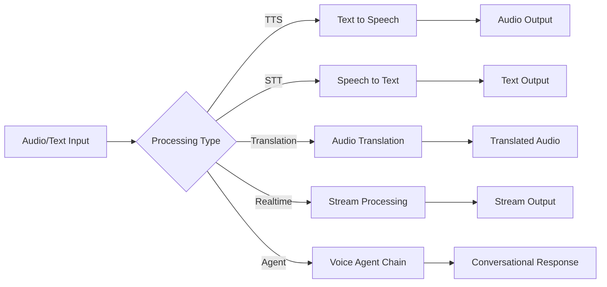
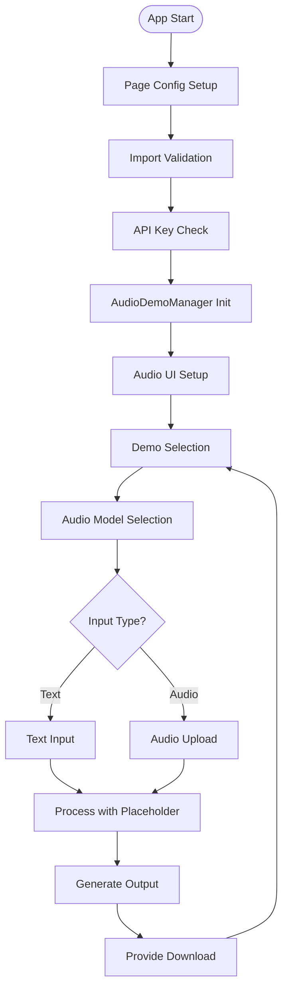
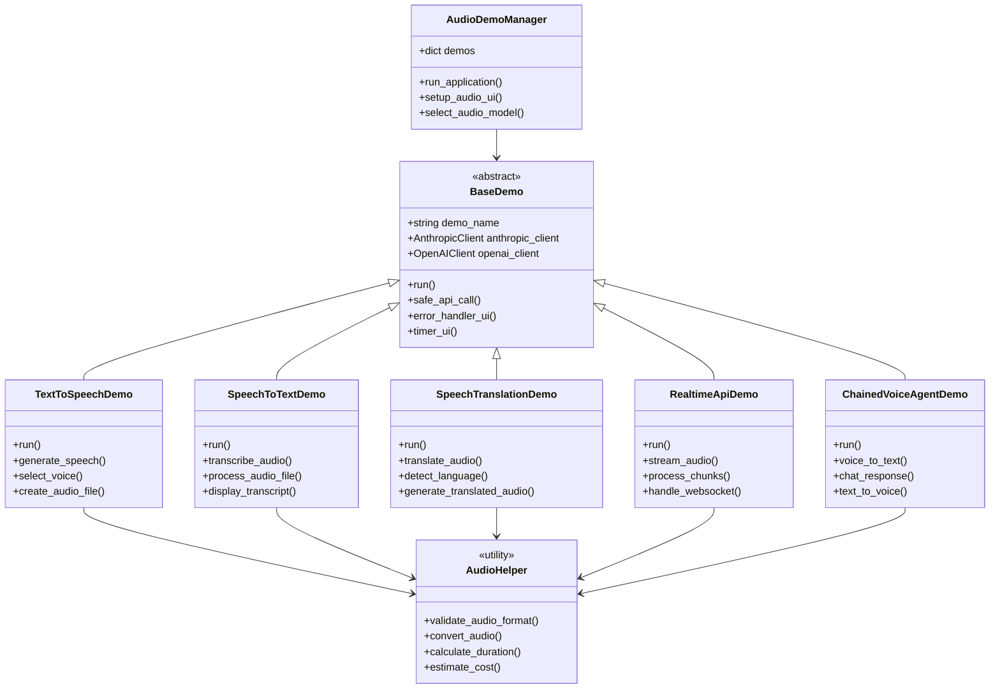
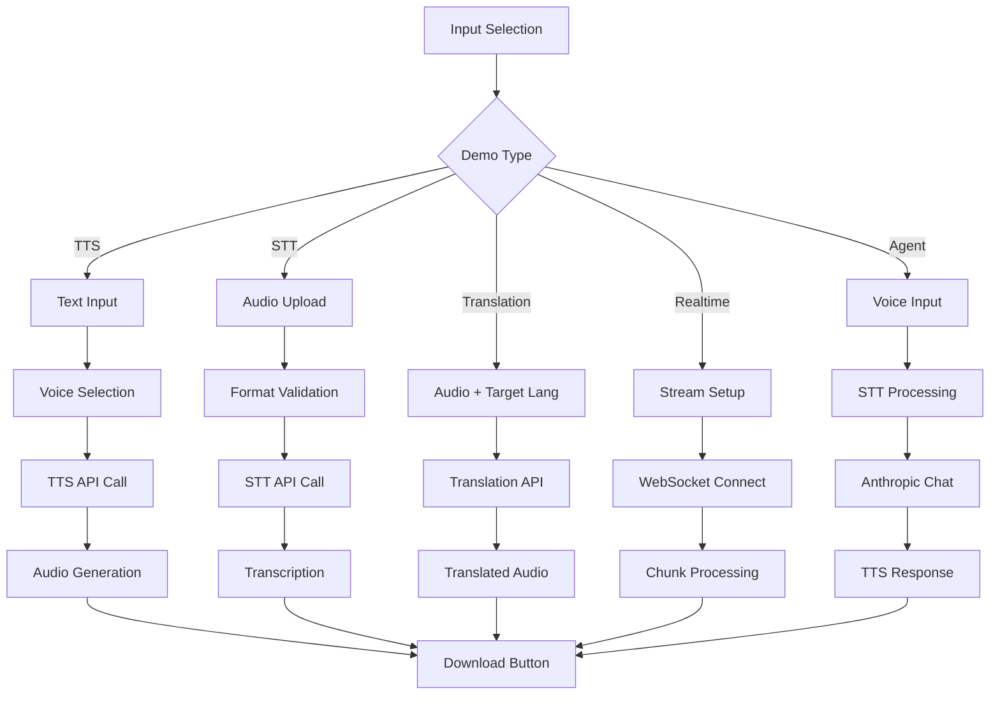
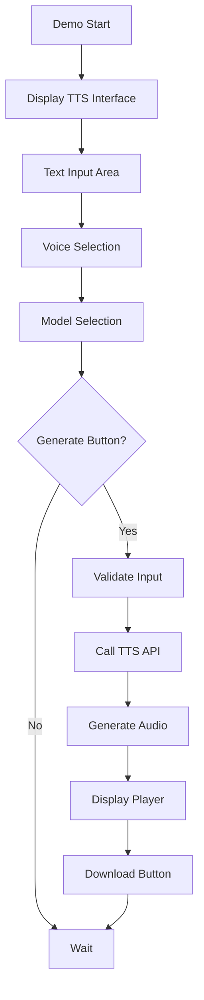
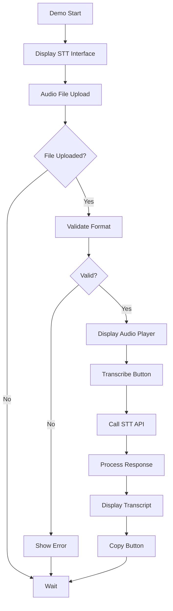
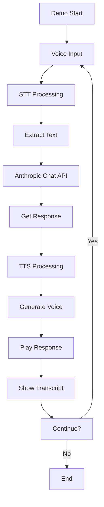
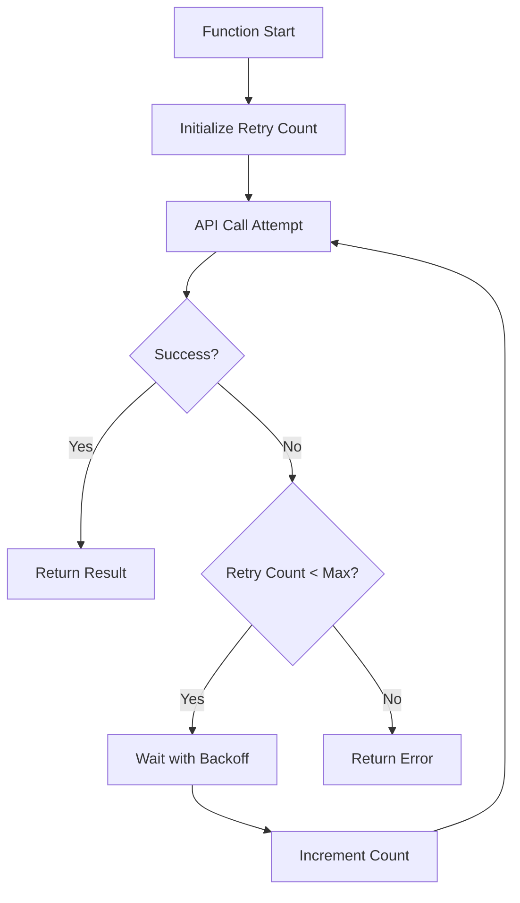
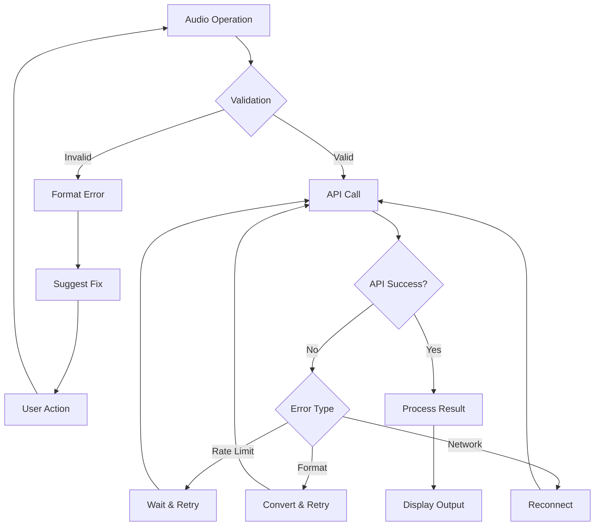

# 📋 a04_audio_speeches.py 設計書

## 📝 目次

1. [📖 概要書](#📖-概要書)
2. [🔧 システム構成](#🔧-システム構成)
3. [📋 関数一覧](#📋-関数一覧)
4. [📑 関数詳細設計](#📑-関数詳細設計)
5. [⚙️ 技術仕様](#⚙️-技術仕様)
6. [🚨 エラーハンドリング](#🚨-エラーハンドリング)

---

## 📖 概要書

### 🎯 処理の概要

**音声・スピーチ処理統合デモアプリケーション**

本アプリケーションは、音声処理機能（TTS、STT、翻訳、リアルタイムAPI）を実装したStreamlit Webアプリケーションです。Anthropic APIは音声処理をネイティブサポートしていないため、外部音声サービス（OpenAI等）との統合パターンを示すプレースホルダー実装として設計されています。

#### 🌟 主要機能

| 機能 | 説明 |
|------|------|
| 🎤 **Text-to-Speech** | テキストから音声生成（TTS） |
| 🎧 **Speech-to-Text** | 音声からテキスト変換（STT） |
| 🌐 **音声翻訳** | 音声の多言語翻訳 |
| ⚡ **リアルタイムAPI** | ストリーミング音声処理 |
| 🤖 **音声エージェント** | 音声→チャット→音声のパイプライン |

#### 🎨 処理対象データ



### 🔄 mainの処理の流れ



---

## 🔧 システム構成

### 📦 主要コンポーネント



### 📋 データフロー



---

## 📋 関数一覧

### 🏗️ アプリケーション制御関数

| 関数名 | 分類 | 処理概要 | 重要度 |
|--------|------|----------|---------|
| `main()` | 🎯 制御 | アプリケーションエントリーポイント | ⭐⭐⭐ |
| `AudioDemoManager.__init__()` | 🔧 初期化 | 音声デモマネージャー初期化 | ⭐⭐⭐ |
| `AudioDemoManager.run_application()` | 🎯 制御 | デモ統合管理・実行制御 | ⭐⭐⭐ |
| `AudioDemoManager.setup_audio_ui()` | 🎨 UI | 音声固有UI設定 | ⭐⭐⭐ |

### 🏭 基底クラス関数

| 関数名 | 分類 | 処理概要 | 重要度 |
|--------|------|----------|---------|
| `BaseDemo.__init__()` | 🔧 初期化 | デモ基盤・複数クライアント初期化 | ⭐⭐⭐ |
| `BaseDemo.safe_api_call()` | 🔌 API | リトライ付き安全なAPI呼び出し | ⭐⭐⭐ |
| `BaseDemo.error_handler_ui()` | 🛡️ 保護 | UI統合エラーハンドリング | ⭐⭐⭐ |
| `BaseDemo.timer_ui()` | 📊 計測 | 実行時間計測デコレータ | ⭐⭐ |

### 🎤 音声処理デモ関数

#### TextToSpeechDemo
| 関数名 | 分類 | 処理概要 | 重要度 |
|--------|------|----------|---------|
| `TextToSpeechDemo.run()` | 🎯 実行 | TTS デモ実行 | ⭐⭐⭐ |
| `TextToSpeechDemo.generate_speech()` | 🔊 生成 | 音声ファイル生成 | ⭐⭐⭐ |
| `TextToSpeechDemo.select_voice()` | 🎨 選択 | 音声タイプ選択 | ⭐⭐ |

#### SpeechToTextDemo
| 関数名 | 分類 | 処理概要 | 重要度 |
|--------|------|----------|---------|
| `SpeechToTextDemo.run()` | 🎯 実行 | STT デモ実行 | ⭐⭐⭐ |
| `SpeechToTextDemo.transcribe_audio()` | 📝 変換 | 音声テキスト変換 | ⭐⭐⭐ |
| `SpeechToTextDemo.process_audio_file()` | 🔍 処理 | 音声ファイル前処理 | ⭐⭐ |

#### ChainedVoiceAgentDemo
| 関数名 | 分類 | 処理概要 | 重要度 |
|--------|------|----------|---------|
| `ChainedVoiceAgentDemo.run()` | 🎯 実行 | 音声エージェントデモ | ⭐⭐⭐ |
| `ChainedVoiceAgentDemo.voice_to_text()` | 🎤 変換 | 音声→テキスト | ⭐⭐⭐ |
| `ChainedVoiceAgentDemo.chat_response()` | 💬 対話 | Anthropic チャット処理 | ⭐⭐⭐ |
| `ChainedVoiceAgentDemo.text_to_voice()` | 🔊 変換 | テキスト→音声 | ⭐⭐⭐ |

### 🔧 ヘルパー関数

| 関数名 | 分類 | 処理概要 | 重要度 |
|--------|------|----------|---------|
| `AudioHelper.validate_audio_format()` | ✅ 検証 | 音声形式検証 | ⭐⭐ |
| `AudioHelper.convert_audio()` | 🔄 変換 | 音声形式変換 | ⭐⭐ |
| `AudioHelper.calculate_duration()` | 📊 計算 | 音声長さ計算 | ⭐ |
| `AudioHelper.estimate_cost()` | 💰 推定 | コスト推定 | ⭐⭐ |

---

## 📑 関数詳細設計

### 🎤 TextToSpeechDemo.run()

#### 🎯 処理概要
テキストから音声ファイルを生成するデモ実装

#### 📊 処理の流れ


#### 📋 IPO設計

| 項目 | 内容 |
|------|------|
| **INPUT** | テキスト、音声タイプ、モデル選択、速度設定 |
| **PROCESS** | 入力検証 → TTS API呼び出し → 音声生成 → ファイル作成 |
| **OUTPUT** | 音声ファイル（MP3/WAV）、再生プレーヤー、ダウンロードリンク |

---

### 🎧 SpeechToTextDemo.run()

#### 🎯 処理概要
音声ファイルをテキストに変換するデモ実装

#### 📊 処理の流れ


#### 📋 IPO設計

| 項目 | 内容 |
|------|------|
| **INPUT** | 音声ファイル（MP3/WAV/M4A）、言語設定 |
| **PROCESS** | ファイル検証 → STT API呼び出し → テキスト抽出 |
| **OUTPUT** | 転写テキスト、信頼度スコア、タイムスタンプ |

---

### 🤖 ChainedVoiceAgentDemo.run()

#### 🎯 処理概要
音声入力→チャット処理→音声出力の連鎖処理

#### 📊 処理の流れ


#### 📋 IPO設計

| 項目 | 内容 |
|------|------|
| **INPUT** | 音声入力、会話コンテキスト |
| **PROCESS** | STT → Anthropic対話 → TTS → 音声出力 |
| **OUTPUT** | 音声応答、テキスト履歴、会話ログ |

---

### 🔌 safe_api_call()

#### 🎯 処理概要
リトライ機能付きの安全なAPI呼び出しラッパー

#### 📊 処理の流れ


#### 📋 IPO設計

| 項目 | 内容 |
|------|------|
| **INPUT** | API関数、引数、最大リトライ数、バックオフ設定 |
| **PROCESS** | API呼び出し → エラー判定 → リトライロジック |
| **OUTPUT** | API結果またはエラー情報 |

---

## ⚙️ 技術仕様

### 📦 依存ライブラリ

| ライブラリ | バージョン | 用途 | 重要度 |
|-----------|-----------|------|---------|
| `streamlit` | 最新 | 🎨 Web UIフレームワーク | ⭐⭐⭐ |
| `anthropic` | 最新 | 🤖 Anthropic Claude API SDK | ⭐⭐⭐ |
| `openai` | 最新 | 🎤 音声処理API（プレースホルダー） | ⭐⭐ |
| `pydub` | 最新 | 🔊 音声ファイル処理 | ⭐⭐ |
| `numpy` | 最新 | 📊 音声データ処理 | ⭐ |

### 🎤 音声フォーマット対応

| フォーマット | 拡張子 | サンプルレート | ビットレート | 備考 |
|------------|--------|--------------|------------|------|
| MP3 | `.mp3` | 16-48 kHz | 32-320 kbps | 推奨形式 |
| WAV | `.wav` | 16-48 kHz | 16/24 bit | 非圧縮 |
| M4A | `.m4a` | 16-48 kHz | 64-256 kbps | Apple形式 |
| FLAC | `.flac` | 16-96 kHz | ロスレス | 高品質 |

### 🔊 音声モデル設定

#### 📋 TTS音声タイプ

```python
VOICE_OPTIONS = {
    "alloy": "中性的な声",
    "echo": "男性的な声",
    "fable": "英国アクセント",
    "onyx": "深い男性声",
    "nova": "女性的な声",
    "shimmer": "優しい女性声"
}

TTS_MODELS = {
    "tts-1": {"quality": "standard", "latency": "low"},
    "tts-1-hd": {"quality": "high", "latency": "medium"}
}
```

#### 📋 STT設定

```python
STT_MODELS = {
    "whisper-1": {
        "languages": ["en", "ja", "es", "fr", "de", "zh"],
        "max_file_size": "25MB",
        "formats": ["mp3", "wav", "m4a", "flac"]
    }
}
```

### 💾 音声処理パイプライン

#### 🗂️ TTS処理フロー

```python
def tts_pipeline(text: str, voice: str) -> bytes:
    # 1. テキスト前処理
    cleaned_text = preprocess_text(text)
    
    # 2. チャンク分割（長文対応）
    chunks = split_into_chunks(cleaned_text, max_chars=4000)
    
    # 3. 各チャンクをTTS処理
    audio_segments = []
    for chunk in chunks:
        audio = generate_speech(chunk, voice)
        audio_segments.append(audio)
    
    # 4. 音声結合
    final_audio = concatenate_audio(audio_segments)
    
    return final_audio
```

#### 📤 STT処理フロー

```python
def stt_pipeline(audio_file) -> dict:
    # 1. 音声検証
    validate_audio(audio_file)
    
    # 2. 形式変換（必要に応じて）
    processed_audio = convert_if_needed(audio_file)
    
    # 3. STT API呼び出し
    transcript = transcribe_audio(processed_audio)
    
    # 4. 後処理
    return {
        "text": transcript.text,
        "language": transcript.language,
        "duration": transcript.duration,
        "confidence": transcript.confidence
    }
```

---

## 🚨 エラーハンドリング

### 📄 エラー分類

| エラー種別 | 原因 | 対処法 | 影響度 |
|-----------|------|--------|---------|
| **形式エラー** | 🎵 非対応音声形式 | 形式変換・再アップロード | 🟡 中 |
| **サイズエラー** | 📦 ファイルサイズ超過 | ファイル分割・圧縮 | 🟡 中 |
| **API制限エラー** | 🚫 レート制限 | 待機・リトライ | 🔴 高 |
| **変換エラー** | 🔄 処理失敗 | パラメータ調整 | 🟡 中 |
| **ネットワークエラー** | 🌐 接続問題 | 再接続・リトライ | 🟡 中 |
| **統合エラー** | 🔗 外部サービス問題 | フォールバック使用 | 🟠 低 |

### 🛠️ エラー処理戦略

```python
def handle_audio_error(error, context):
    if isinstance(error, FormatError):
        st.error("❌ サポートされていない音声形式です")
        st.info("対応形式: MP3, WAV, M4A, FLAC")
        suggest_conversion(error.format)
        
    elif isinstance(error, SizeError):
        st.warning("⚠️ ファイルサイズが制限を超えています")
        st.info(f"最大サイズ: {MAX_FILE_SIZE}MB")
        suggest_compression()
        
    elif isinstance(error, APIError):
        if error.code == 429:  # Rate limit
            wait_time = calculate_backoff()
            st.info(f"⏳ {wait_time}秒後に再試行します...")
            time.sleep(wait_time)
            return retry_operation(context)
        else:
            st.error(f"❌ API エラー: {error.message}")
            
    return None
```

### 🎨 エラー表示パターン

```python
# プレースホルダー実装の明示
def show_placeholder_notice():
    with st.info_container():
        st.info("""
        ℹ️ 音声機能デモ（プレースホルダー実装）
        
        このデモは音声処理統合パターンを示すものです。
        実際の音声処理には外部サービス（OpenAI等）の
        APIキーが必要です。
        """)
```

### 🔄 エラー復旧フロー



---

## 🎉 まとめ

この設計書は、**a04_audio_speeches.py** の包括的な技術仕様と実装詳細を網羅した完全ドキュメントです。

### 🌟 設計のハイライト

- **🎤 包括的音声処理**: TTS/STT/翻訳/リアルタイム対応
- **🔗 統合パターン**: 外部音声サービスとの連携設計
- **🤖 チェーン処理**: 音声エージェントパイプライン
- **🛡️ 堅牢性**: リトライ機能付きエラーハンドリング
- **📊 プレースホルダー設計**: 実装パターンの明確な提示

### 🔧 アーキテクチャ特徴

- **📦 モジュール構成**: 音声処理タイプ別の独立実装
- **🔄 API抽象化**: 複数音声サービスへの対応準備
- **💾 セッション管理**: 音声会話の状態保持
- **🎨 UI/UX**: 音声固有のインターフェース要素