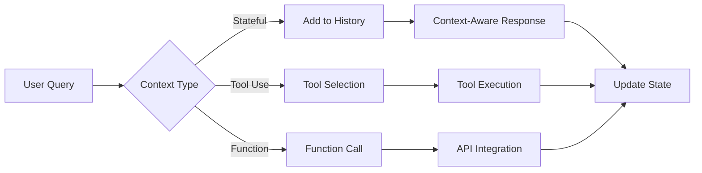
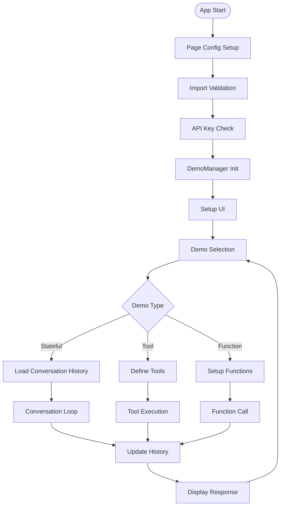
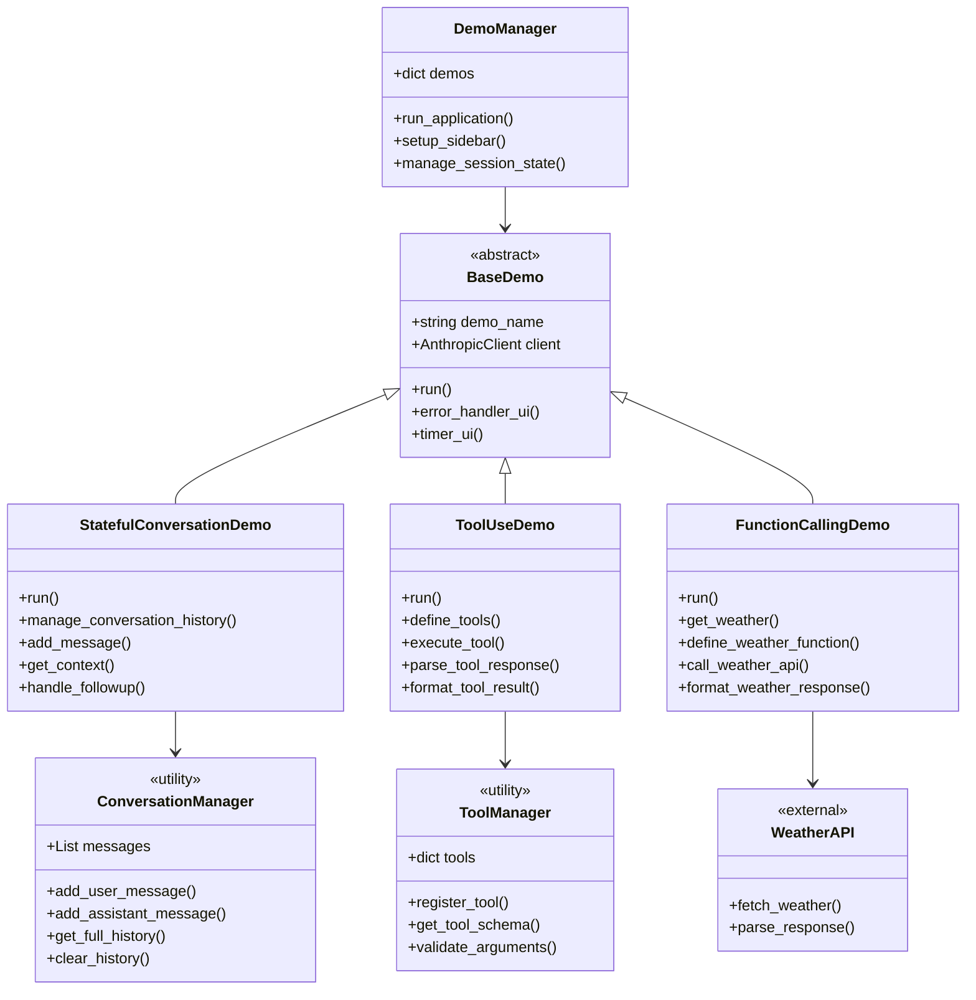
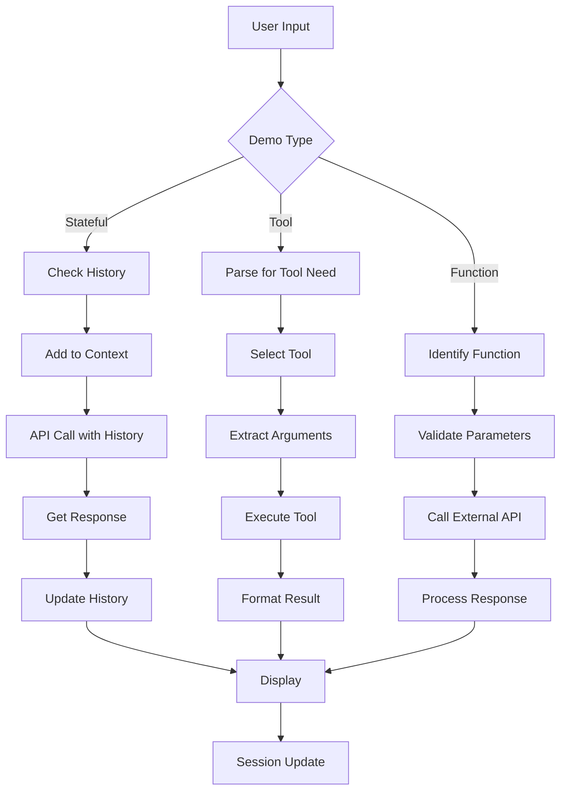
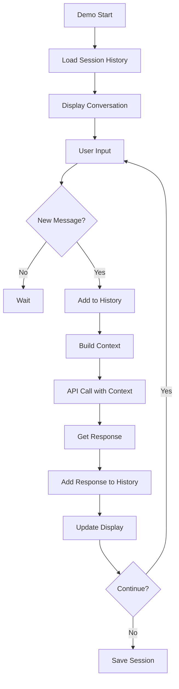
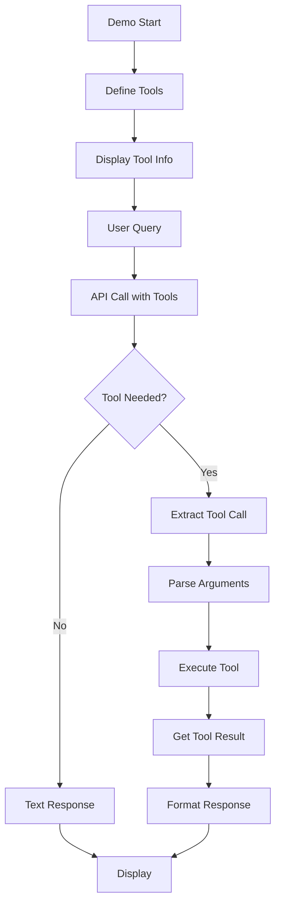
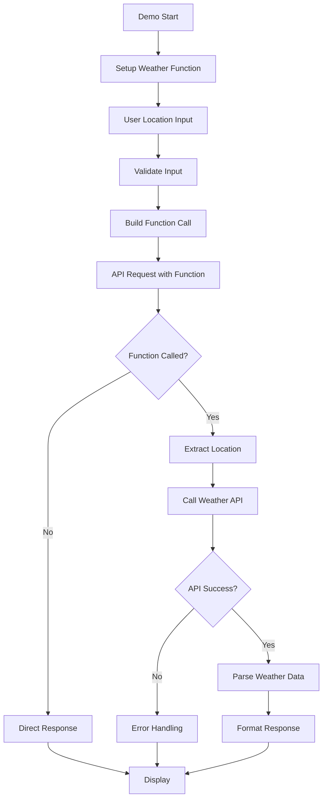
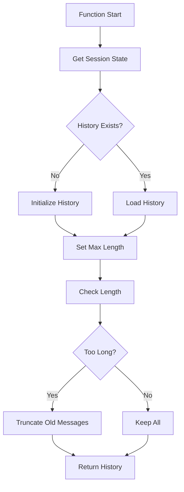
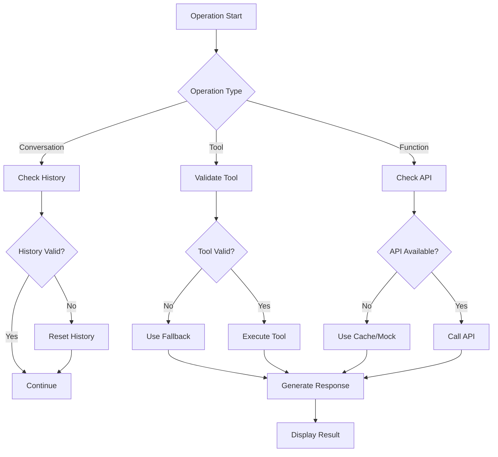

# 📋 a05_conversation_state.py 設計書

## 📝 目次

1. [📖 概要書](#📖-概要書)
2. [🔧 システム構成](#🔧-システム構成)
3. [📋 関数一覧](#📋-関数一覧)
4. [📑 関数詳細設計](#📑-関数詳細設計)
5. [⚙️ 技術仕様](#⚙️-技術仕様)
6. [🚨 エラーハンドリング](#🚨-エラーハンドリング)

---

## 📖 概要書

### 🎯 処理の概要

**会話状態管理・ツール使用デモアプリケーション**

本アプリケーションは、Anthropic Claude APIを使用した状態管理型の会話システムと、ツール使用（Function Calling）機能を実装したStreamlit Webアプリケーションです。会話コンテキストの保持、フォローアップ質問への対応、外部APIとの連携を通じて、高度な対話システムを実現します。

#### 🌟 主要機能

| 機能 | 説明 |
|------|------|
| 💬 **状態維持会話** | 会話履歴を保持した文脈認識対話 |
| 🔧 **ツール使用** | カスタムツール定義と実行 |
| 🌤️ **関数呼び出し** | 天気APIなど外部サービス連携 |
| 📊 **構造化出力** | ツール引数の型安全な処理 |
| 🔄 **フォローアップ** | 文脈を考慮した連続質問対応 |

#### 🎨 処理対象データ



### 🔄 mainの処理の流れ



---

## 🔧 システム構成

### 📦 主要コンポーネント



### 📋 データフロー



---

## 📋 関数一覧

### 🏗️ アプリケーション制御関数

| 関数名 | 分類 | 処理概要 | 重要度 |
|--------|------|----------|---------|
| `main()` | 🎯 制御 | アプリケーションエントリーポイント | ⭐⭐⭐ |
| `DemoManager.__init__()` | 🔧 初期化 | デモマネージャー初期化 | ⭐⭐⭐ |
| `DemoManager.run_application()` | 🎯 制御 | デモ統合管理・実行制御 | ⭐⭐⭐ |
| `DemoManager.setup_sidebar()` | 🎨 UI | サイドバー設定・デモ選択 | ⭐⭐⭐ |

### 💬 会話状態管理関数

| 関数名 | 分類 | 処理概要 | 重要度 |
|--------|------|----------|---------|
| `StatefulConversationDemo.run()` | 🎯 実行 | 状態維持会話デモ実行 | ⭐⭐⭐ |
| `StatefulConversationDemo.manage_conversation_history()` | 📝 管理 | 会話履歴管理 | ⭐⭐⭐ |
| `StatefulConversationDemo.add_message()` | ➕ 追加 | メッセージ履歴追加 | ⭐⭐ |
| `StatefulConversationDemo.get_context()` | 📖 取得 | コンテキスト取得 | ⭐⭐ |
| `StatefulConversationDemo.handle_followup()` | 🔄 処理 | フォローアップ質問処理 | ⭐⭐⭐ |

### 🔧 ツール使用関数

| 関数名 | 分類 | 処理概要 | 重要度 |
|--------|------|----------|---------|
| `ToolUseDemo.run()` | 🎯 実行 | ツール使用デモ実行 | ⭐⭐⭐ |
| `ToolUseDemo.define_tools()` | 📝 定義 | ツールスキーマ定義 | ⭐⭐⭐ |
| `ToolUseDemo.execute_tool()` | ⚡ 実行 | ツール実行処理 | ⭐⭐⭐ |
| `ToolUseDemo.parse_tool_response()` | 🔍 解析 | ツール応答解析 | ⭐⭐ |
| `ToolUseDemo.format_tool_result()` | 📋 整形 | ツール結果整形 | ⭐ |

### 🌤️ 関数呼び出し関数

| 関数名 | 分類 | 処理概要 | 重要度 |
|--------|------|----------|---------|
| `FunctionCallingDemo.run()` | 🎯 実行 | 関数呼び出しデモ実行 | ⭐⭐⭐ |
| `FunctionCallingDemo.get_weather()` | 🌤️ API | 天気情報取得 | ⭐⭐⭐ |
| `FunctionCallingDemo.define_weather_function()` | 📝 定義 | 天気関数定義 | ⭐⭐ |
| `FunctionCallingDemo.call_weather_api()` | 🔌 呼出 | 外部API呼び出し | ⭐⭐⭐ |
| `FunctionCallingDemo.format_weather_response()` | 📋 整形 | 天気データ整形 | ⭐ |

---

## 📑 関数詳細設計

### 💬 StatefulConversationDemo.run()

#### 🎯 処理概要
会話履歴を保持した状態管理型の対話デモ

#### 📊 処理の流れ


#### 📋 IPO設計

| 項目 | 内容 |
|------|------|
| **INPUT** | ユーザーメッセージ、会話履歴、モデル設定 |
| **PROCESS** | 履歴管理 → コンテキスト構築 → API呼び出し → 履歴更新 |
| **OUTPUT** | コンテキスト考慮済み応答、更新済み会話履歴 |

---

### 🔧 ToolUseDemo.run()

#### 🎯 処理概要
カスタムツール定義と実行を行うデモ

#### 📊 処理の流れ


#### 📋 IPO設計

| 項目 | 内容 |
|------|------|
| **INPUT** | ユーザークエリ、ツール定義、実行パラメータ |
| **PROCESS** | ツール選択 → 引数抽出 → ツール実行 → 結果整形 |
| **OUTPUT** | ツール実行結果、構造化応答 |

#### 💻 ツール定義例

```python
tools = [
    {
        "name": "get_weather",
        "description": "Get weather information for a location",
        "input_schema": {
            "type": "object",
            "properties": {
                "location": {
                    "type": "string",
                    "description": "City name"
                },
                "units": {
                    "type": "string",
                    "enum": ["celsius", "fahrenheit"]
                }
            },
            "required": ["location"]
        }
    }
]
```

---

### 🌤️ FunctionCallingDemo.run()

#### 🎯 処理概要
外部API（天気情報）と連携する関数呼び出しデモ

#### 📊 処理の流れ


#### 📋 IPO設計

| 項目 | 内容 |
|------|------|
| **INPUT** | 都市名、単位設定（摂氏/華氏） |
| **PROCESS** | 関数定義 → API呼び出し → 天気データ取得 → 結果整形 |
| **OUTPUT** | 天気情報（温度、湿度、天候、予報） |

---

### 📝 manage_conversation_history()

#### 🎯 処理概要
会話履歴の管理と文脈構築

#### 📊 処理の流れ


#### 📋 IPO設計

| 項目 | 内容 |
|------|------|
| **INPUT** | セッション状態、最大履歴長 |
| **PROCESS** | 履歴取得 → 長さ確認 → 必要に応じて切り詰め |
| **OUTPUT** | 管理済み会話履歴配列 |

---

## ⚙️ 技術仕様

### 📦 依存ライブラリ

| ライブラリ | バージョン | 用途 | 重要度 |
|-----------|-----------|------|---------|
| `streamlit` | 最新 | 🎨 Web UIフレームワーク | ⭐⭐⭐ |
| `anthropic` | 最新 | 🤖 Anthropic Claude API SDK | ⭐⭐⭐ |
| `pydantic` | 2.0+ | 📊 データ検証 | ⭐⭐ |
| `requests` | 最新 | 🌐 外部API通信 | ⭐⭐ |
| `python-dotenv` | 最新 | 🔑 環境変数管理 | ⭐ |

### 💬 会話状態管理仕様

#### 📋 メッセージ構造

```python
class Message:
    role: str  # "user" or "assistant"
    content: str
    timestamp: datetime
    metadata: dict  # Additional context

class ConversationState:
    messages: List[Message]
    context_window: int = 10  # Max messages to keep
    total_tokens: int = 0
    session_id: str
```

#### 🔄 コンテキスト管理戦略

```python
def build_context(history: List[Message], max_tokens: int = 4000):
    # 1. 最新メッセージを優先
    context = []
    token_count = 0
    
    for msg in reversed(history):
        msg_tokens = count_tokens(msg.content)
        if token_count + msg_tokens > max_tokens:
            break
        context.insert(0, msg)
        token_count += msg_tokens
    
    return context
```

### 🔧 ツール使用仕様

#### 📋 ツール定義フォーマット

```json
{
    "name": "tool_name",
    "description": "Tool description",
    "input_schema": {
        "type": "object",
        "properties": {
            "param1": {
                "type": "string",
                "description": "Parameter description"
            }
        },
        "required": ["param1"]
    }
}
```

#### 🔌 ツール実行パターン

```python
def execute_tool(tool_name: str, arguments: dict):
    tool_registry = {
        "get_weather": get_weather_function,
        "search_web": search_web_function,
        "calculate": calculate_function
    }
    
    if tool_name in tool_registry:
        tool_func = tool_registry[tool_name]
        try:
            result = tool_func(**arguments)
            return {"success": True, "result": result}
        except Exception as e:
            return {"success": False, "error": str(e)}
    
    return {"success": False, "error": "Tool not found"}
```

### 🌤️ 外部API統合

#### 📋 Open-Meteo Weather API

```python
WEATHER_API_CONFIG = {
    "base_url": "https://api.open-meteo.com/v1/forecast",
    "params": {
        "current_weather": True,
        "hourly": ["temperature_2m", "precipitation"],
        "daily": ["temperature_2m_max", "temperature_2m_min"],
        "timezone": "auto"
    }
}

def fetch_weather(latitude: float, longitude: float):
    params = {
        "latitude": latitude,
        "longitude": longitude,
        **WEATHER_API_CONFIG["params"]
    }
    response = requests.get(
        WEATHER_API_CONFIG["base_url"],
        params=params
    )
    return response.json()
```

---

## 🚨 エラーハンドリング

### 📄 エラー分類

| エラー種別 | 原因 | 対処法 | 影響度 |
|-----------|------|--------|---------|
| **履歴超過エラー** | 📝 会話履歴が長すぎる | 古いメッセージ削除 | 🟡 中 |
| **ツール実行エラー** | 🔧 ツール処理失敗 | フォールバック応答 | 🟡 中 |
| **API呼び出しエラー** | 🌐 外部API失敗 | リトライ・キャッシュ使用 | 🟡 中 |
| **引数検証エラー** | 📊 不正なツール引数 | デフォルト値使用 | 🟠 低 |
| **セッションエラー** | 💾 状態保存失敗 | セッションリセット | 🔴 高 |

### 🛠️ エラー処理戦略

```python
def safe_tool_execution(tool_call):
    try:
        # 引数検証
        validated_args = validate_tool_arguments(
            tool_call.name,
            tool_call.arguments
        )
    except ValidationError as e:
        return create_error_response(
            f"引数検証エラー: {e}",
            fallback=True
        )
    
    try:
        # ツール実行
        result = execute_tool(tool_call.name, validated_args)
    except ToolExecutionError as e:
        # フォールバック処理
        return create_fallback_response(tool_call.name)
    except Exception as e:
        # 一般エラー
        logger.error(f"Tool execution failed: {e}")
        return create_error_response(str(e))
    
    return format_tool_result(result)
```

### 🎨 エラー表示パターン

```python
# 会話状態エラー
if error_type == "history_overflow":
    st.warning("⚠️ 会話履歴が制限を超えました")
    if st.button("古い履歴をクリア"):
        clear_old_history()
        st.success("✅ 履歴をクリアしました")

# ツールエラー
elif error_type == "tool_execution":
    st.error("❌ ツール実行エラー")
    with st.expander("エラー詳細"):
        st.code(error_details)
    st.info("💡 別の方法で回答を生成します...")
```

### 🔄 エラー復旧フロー



---

## 🎉 まとめ

この設計書は、**a05_conversation_state.py** の包括的な技術仕様と実装詳細を網羅した完全ドキュメントです。

### 🌟 設計のハイライト

- **💬 状態管理**: 会話履歴の効率的な管理と文脈保持
- **🔧 ツール統合**: 柔軟なツール定義と実行フレームワーク
- **🌤️ API連携**: 外部サービスとのシームレスな統合
- **📊 型安全性**: Pydanticによる引数検証
- **🛡️ 堅牢性**: 包括的なエラーハンドリング

### 🔧 アーキテクチャ特徴

- **📦 モジュール設計**: 機能別の独立した実装
- **🔄 拡張性**: 新規ツール・関数の容易な追加
- **💾 永続性**: セッション跨ぎの状態保持
- **🎨 UX最適化**: 直感的な会話インターフェース