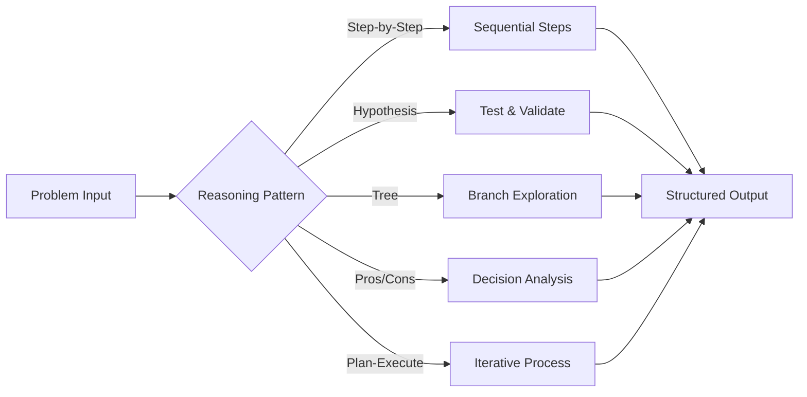
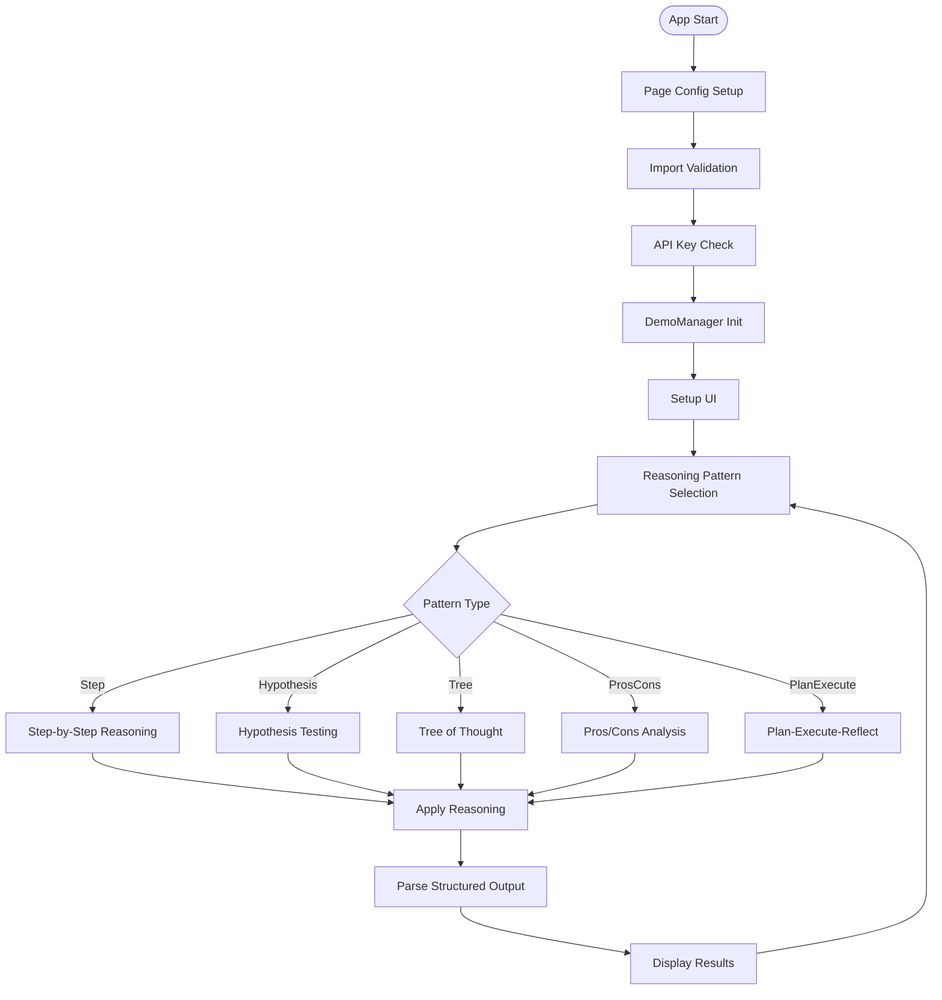
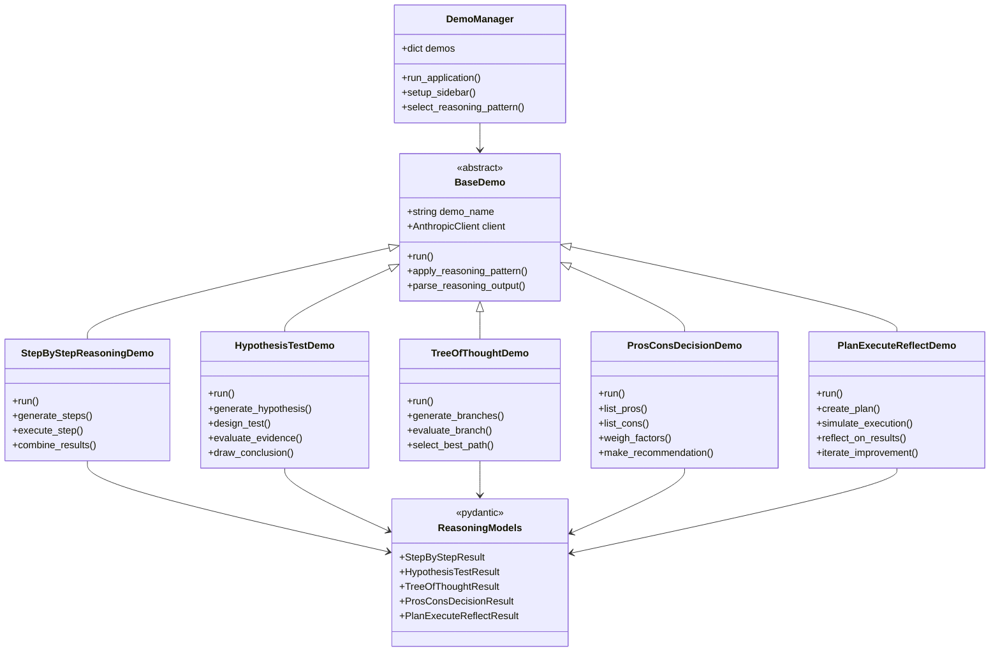
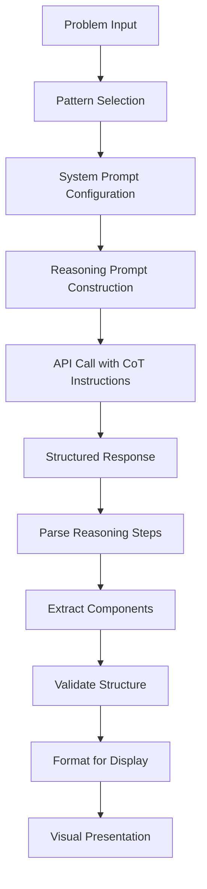
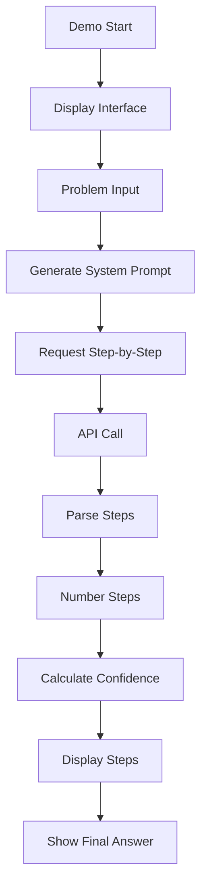
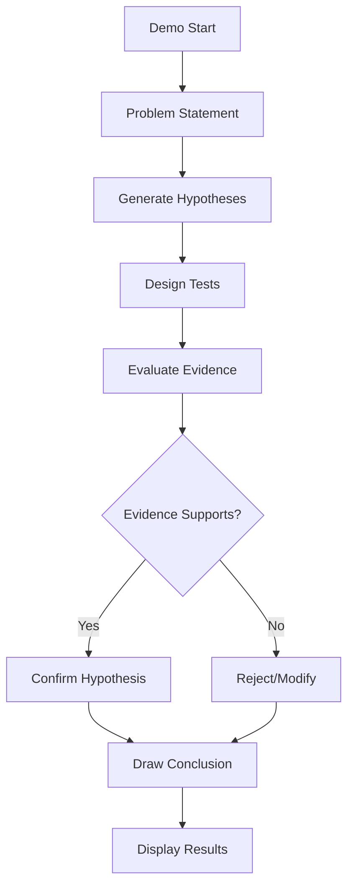
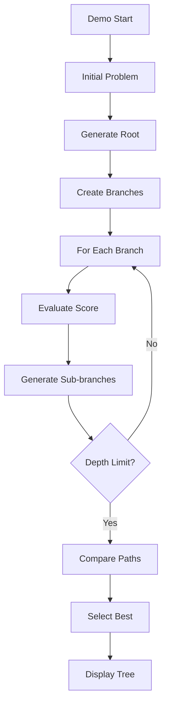
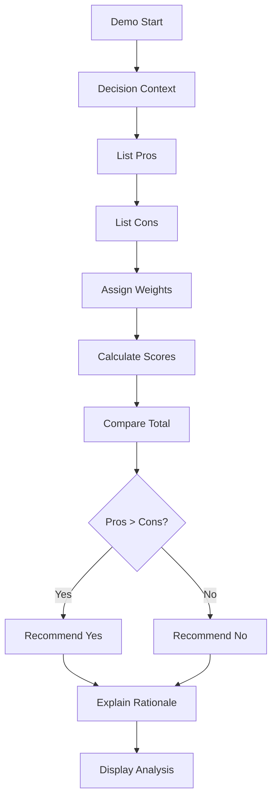
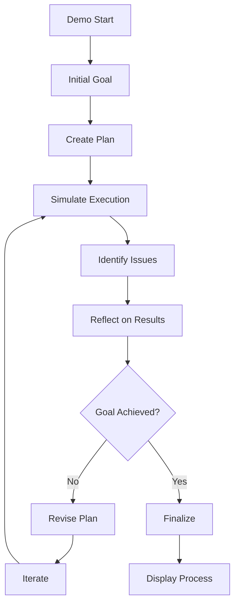
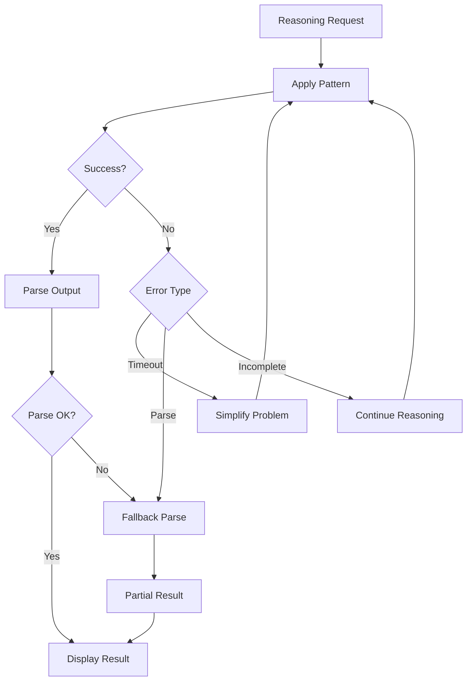

# 📋 a06_reasoning_chain_of_thought.py 設計書

## 📝 目次

1. [📖 概要書](#📖-概要書)
2. [🔧 システム構成](#🔧-システム構成)
3. [📋 関数一覧](#📋-関数一覧)
4. [📑 関数詳細設計](#📑-関数詳細設計)
5. [⚙️ 技術仕様](#⚙️-技術仕様)
6. [🚨 エラーハンドリング](#🚨-エラーハンドリング)

---

## 📖 概要書

### 🎯 処理の概要

**Chain of Thought（思考連鎖）推論パターンデモアプリケーション**

本アプリケーションは、Anthropic Claude APIを使用した様々な思考連鎖（Chain of Thought, CoT）推論パターンを実装したStreamlit Webアプリケーションです。段階的推論、仮説検証、思考の木探索、意思決定分析、計画・実行・振り返りなど、構造化された問題解決アプローチを提供します。

#### 🌟 主要機能

| 機能 | 説明 |
|------|------|
| 📝 **段階的推論** | 問題を順序立てて解決する基本CoT |
| 🔬 **仮説検証** | 科学的手法による仮説生成と検証 |
| 🌳 **思考の木探索** | 複数の解法パスを探索・評価 |
| ⚖️ **賛否分析** | 意思決定のための比較検討 |
| 🔄 **計画実行振り返り** | 反復的改善プロセス |

#### 🎨 処理対象データ



### 🔄 mainの処理の流れ



---

## 🔧 システム構成

### 📦 主要コンポーネント



### 📋 データフロー



---

## 📋 関数一覧

### 🏗️ アプリケーション制御関数

| 関数名 | 分類 | 処理概要 | 重要度 |
|--------|------|----------|---------|
| `main()` | 🎯 制御 | アプリケーションエントリーポイント | ⭐⭐⭐ |
| `DemoManager.__init__()` | 🔧 初期化 | デモマネージャー初期化 | ⭐⭐⭐ |
| `DemoManager.run_application()` | 🎯 制御 | デモ統合管理・実行制御 | ⭐⭐⭐ |
| `DemoManager.setup_sidebar()` | 🎨 UI | サイドバー設定・パターン選択 | ⭐⭐⭐ |

### 📝 段階的推論関数

| 関数名 | 分類 | 処理概要 | 重要度 |
|--------|------|----------|---------|
| `StepByStepReasoningDemo.run()` | 🎯 実行 | 段階的推論デモ実行 | ⭐⭐⭐ |
| `StepByStepReasoningDemo.generate_steps()` | 📝 生成 | 推論ステップ生成 | ⭐⭐⭐ |
| `StepByStepReasoningDemo.execute_step()` | ⚡ 実行 | 個別ステップ実行 | ⭐⭐ |
| `StepByStepReasoningDemo.combine_results()` | 🔄 統合 | ステップ結果統合 | ⭐⭐ |

### 🔬 仮説検証関数

| 関数名 | 分類 | 処理概要 | 重要度 |
|--------|------|----------|---------|
| `HypothesisTestDemo.run()` | 🎯 実行 | 仮説検証デモ実行 | ⭐⭐⭐ |
| `HypothesisTestDemo.generate_hypothesis()` | 💡 生成 | 仮説生成 | ⭐⭐⭐ |
| `HypothesisTestDemo.design_test()` | 🧪 設計 | テスト設計 | ⭐⭐ |
| `HypothesisTestDemo.evaluate_evidence()` | 📊 評価 | 証拠評価 | ⭐⭐⭐ |

### 🌳 思考の木探索関数

| 関数名 | 分類 | 処理概要 | 重要度 |
|--------|------|----------|---------|
| `TreeOfThoughtDemo.run()` | 🎯 実行 | 思考の木デモ実行 | ⭐⭐⭐ |
| `TreeOfThoughtDemo.generate_branches()` | 🌿 生成 | 分岐生成 | ⭐⭐⭐ |
| `TreeOfThoughtDemo.evaluate_branch()` | 📈 評価 | 分岐評価 | ⭐⭐⭐ |
| `TreeOfThoughtDemo.select_best_path()` | 🎯 選択 | 最適パス選択 | ⭐⭐⭐ |

### 🎯 Pydanticモデル定義

| モデル名 | 分類 | フィールド構成 | 重要度 |
|---------|------|--------------|---------|
| `StepByStepResult` | 📝 段階 | steps, final_answer, confidence | ⭐⭐⭐ |
| `HypothesisTestResult` | 🔬 仮説 | hypothesis, tests, evidence, conclusion | ⭐⭐⭐ |
| `TreeOfThoughtResult` | 🌳 木 | branches, evaluations, best_path | ⭐⭐⭐ |
| `ProsConsDecisionResult` | ⚖️ 決定 | pros, cons, recommendation, rationale | ⭐⭐⭐ |
| `PlanExecuteReflectResult` | 🔄 反復 | plan, execution, reflection, improvements | ⭐⭐⭐ |

---

## 📑 関数詳細設計

### 📝 StepByStepReasoningDemo.run()

#### 🎯 処理概要
問題を段階的に分解して解決する基本的なCoTパターン

#### 📊 処理の流れ


#### 📋 IPO設計

| 項目 | 内容 |
|------|------|
| **INPUT** | 問題文、詳細度設定、最大ステップ数 |
| **PROCESS** | プロンプト構築 → 段階的推論 → ステップ解析 → 結果統合 |
| **OUTPUT** | 番号付きステップ、最終回答、信頼度スコア |

#### 💻 プロンプト例

```python
system_prompt = """
Let's solve this step-by-step:

1. First, understand what we're asked to find
2. Break down the problem into smaller parts
3. Solve each part systematically
4. Combine the results
5. Verify the answer

Show your work for each step.
"""
```

---

### 🔬 HypothesisTestDemo.run()

#### 🎯 処理概要
科学的手法に基づく仮説生成と検証プロセス

#### 📊 処理の流れ


#### 📋 IPO設計

| 項目 | 内容 |
|------|------|
| **INPUT** | 問題・観察事項、既知の情報 |
| **PROCESS** | 仮説生成 → テスト設計 → 証拠評価 → 結論導出 |
| **OUTPUT** | 仮説リスト、テスト結果、最終結論 |

---

### 🌳 TreeOfThoughtDemo.run()

#### 🎯 処理概要
複数の解法パスを探索し最適解を選択

#### 📊 処理の流れ


#### 📋 IPO設計

| 項目 | 内容 |
|------|------|
| **INPUT** | 問題、分岐数、探索深度 |
| **PROCESS** | 分岐生成 → スコア評価 → 再帰探索 → 最適パス選択 |
| **OUTPUT** | 思考ツリー、各パスのスコア、最適解 |

---

### ⚖️ ProsConsDecisionDemo.run()

#### 🎯 処理概要
意思決定のための賛否比較分析

#### 📊 処理の流れ


#### 📋 IPO設計

| 項目 | 内容 |
|------|------|
| **INPUT** | 意思決定の文脈、評価基準 |
| **PROCESS** | 利点列挙 → 欠点列挙 → 重み付け → スコア計算 → 推奨 |
| **OUTPUT** | 賛否リスト、重要度、推奨事項、根拠 |

---

### 🔄 PlanExecuteReflectDemo.run()

#### 🎯 処理概要
計画・実行・振り返りによる反復改善プロセス

#### 📊 処理の流れ


#### 📋 IPO設計

| 項目 | 内容 |
|------|------|
| **INPUT** | 目標、制約条件、反復回数上限 |
| **PROCESS** | 計画立案 → 実行シミュレーション → 振り返り → 改善 |
| **OUTPUT** | 初期計画、実行結果、改善点、最終計画 |

---

## ⚙️ 技術仕様

### 📦 依存ライブラリ

| ライブラリ | バージョン | 用途 | 重要度 |
|-----------|-----------|------|---------|
| `streamlit` | 最新 | 🎨 Web UIフレームワーク | ⭐⭐⭐ |
| `anthropic` | 最新 | 🤖 Anthropic Claude API SDK | ⭐⭐⭐ |
| `pydantic` | 2.0+ | 📊 データモデル定義・検証 | ⭐⭐⭐ |
| `typing` | 標準 | 🔍 型ヒント | ⭐⭐ |

### 🧠 推論パターン仕様

#### 📋 パターン別システムプロンプト

```python
REASONING_PATTERNS = {
    "step_by_step": """
    Break down the problem into clear, numbered steps.
    Show your work for each step.
    Provide a confidence score (0-100) for your final answer.
    """,
    
    "hypothesis_test": """
    1. Generate multiple hypotheses
    2. Design tests for each hypothesis
    3. Evaluate evidence
    4. Draw conclusions based on evidence
    """,
    
    "tree_of_thought": """
    Explore multiple solution paths:
    - Generate 3 different approaches
    - Evaluate each approach (score 1-10)
    - Explore the most promising path further
    - Select the best overall solution
    """,
    
    "pros_cons": """
    Analyze the decision:
    - List all pros with importance (1-5)
    - List all cons with importance (1-5)
    - Provide weighted recommendation
    - Explain your reasoning
    """,
    
    "plan_execute_reflect": """
    1. Create initial plan
    2. Simulate execution
    3. Identify what went well/poorly
    4. Suggest improvements
    5. Create refined plan
    """
}
```

### 📊 構造化出力パーシング

#### 🔍 応答解析パターン

```python
def parse_reasoning_output(response: str, pattern: str):
    if pattern == "step_by_step":
        steps = extract_numbered_steps(response)
        answer = extract_final_answer(response)
        confidence = extract_confidence_score(response)
        
    elif pattern == "hypothesis_test":
        hypotheses = extract_hypotheses(response)
        tests = extract_test_descriptions(response)
        evidence = extract_evidence_evaluation(response)
        conclusion = extract_conclusion(response)
        
    elif pattern == "tree_of_thought":
        branches = extract_branches(response)
        scores = extract_branch_scores(response)
        best_path = identify_best_path(branches, scores)
        
    return structured_result
```

### 💾 視覚化仕様

#### 🎨 推論結果表示

```python
def display_reasoning_result(result, pattern):
    if pattern == "step_by_step":
        # 番号付きステップ表示
        for i, step in enumerate(result.steps, 1):
            st.write(f"**Step {i}:** {step}")
        st.success(f"**Answer:** {result.final_answer}")
        st.progress(result.confidence / 100)
        
    elif pattern == "tree_of_thought":
        # ツリー構造表示
        display_tree_visualization(result.branches)
        highlight_best_path(result.best_path)
        
    elif pattern == "pros_cons":
        # 2カラムレイアウト
        col1, col2 = st.columns(2)
        with col1:
            st.subheader("✅ Pros")
            for pro in result.pros:
                st.write(f"• {pro.point} ({pro.weight}★)")
        with col2:
            st.subheader("❌ Cons")
            for con in result.cons:
                st.write(f"• {con.point} ({con.weight}★)")
```

---

## 🚨 エラーハンドリング

### 📄 エラー分類

| エラー種別 | 原因 | 対処法 | 影響度 |
|-----------|------|--------|---------|
| **パース失敗** | 📝 構造化出力の解析失敗 | フォールバック解析 | 🟡 中 |
| **推論不完全** | 🧠 ステップ不足 | 追加推論要求 | 🟡 中 |
| **タイムアウト** | ⏱️ 複雑な推論による遅延 | 簡略化・分割 | 🟡 中 |
| **構造不一致** | 📊 期待構造との不一致 | 柔軟な解析 | 🟠 低 |
| **循環推論** | 🔄 無限ループ検出 | 深度制限 | 🔴 高 |

### 🛠️ エラー処理戦略

```python
def safe_reasoning_execution(problem, pattern):
    try:
        # 推論実行
        result = apply_reasoning_pattern(problem, pattern)
    except ParseError as e:
        # パースエラー時のフォールバック
        st.warning("構造化解析に失敗、別形式で解析中...")
        result = fallback_parse(response)
        
    except TimeoutError:
        # タイムアウト時の処理
        st.error("推論がタイムアウトしました")
        st.info("問題を簡略化して再試行してください")
        return simplified_reasoning(problem)
        
    except RecursionError:
        # 循環推論の検出
        st.error("循環推論を検出しました")
        return apply_depth_limit(problem, max_depth=5)
        
    return result
```

### 🎨 エラー表示パターン

```python
# 推論エラーの表示
if error_type == "incomplete_reasoning":
    st.warning("⚠️ 推論が不完全です")
    with st.expander("詳細"):
        st.write(f"完了ステップ: {completed_steps}")
        st.write(f"未完了: {remaining_steps}")
    if st.button("続行"):
        continue_reasoning()
        
elif error_type == "parse_failure":
    st.error("❌ 構造化出力の解析に失敗")
    st.info("💡 生の出力を表示します")
    st.text(raw_response)
```

### 🔄 エラー復旧フロー



---

## 🎉 まとめ

この設計書は、**a06_reasoning_chain_of_thought.py** の包括的な技術仕様と実装詳細を網羅した完全ドキュメントです。

### 🌟 設計のハイライト

- **🧠 多様な推論パターン**: 5つの異なるCoTアプローチ
- **📊 構造化思考**: 体系的な問題解決フレームワーク
- **🔍 解析可能な出力**: Pydanticによる型安全な結果
- **🎨 視覚的表現**: 推論プロセスの直感的な表示
- **🛡️ 堅牢性**: 複雑な推論に対するエラー処理

### 🔧 アーキテクチャ特徴

- **📦 パターン独立性**: 各推論パターンの独立実装
- **🔄 拡張性**: 新規推論パターンの容易な追加
- **💾 再利用性**: 共通推論コンポーネントの活用
- **🎯 実用性**: 実問題への適用可能な設計