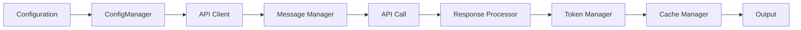
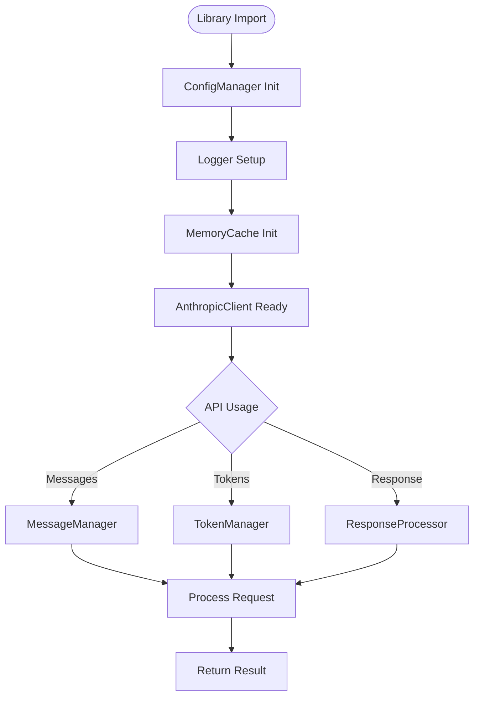
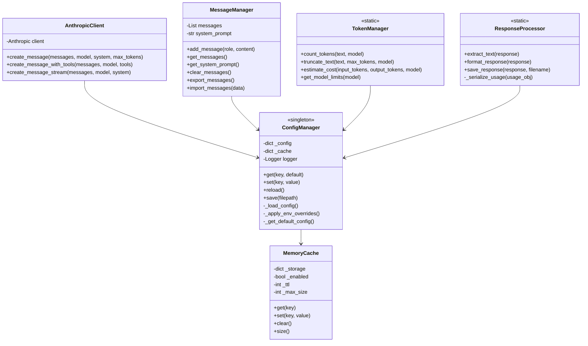
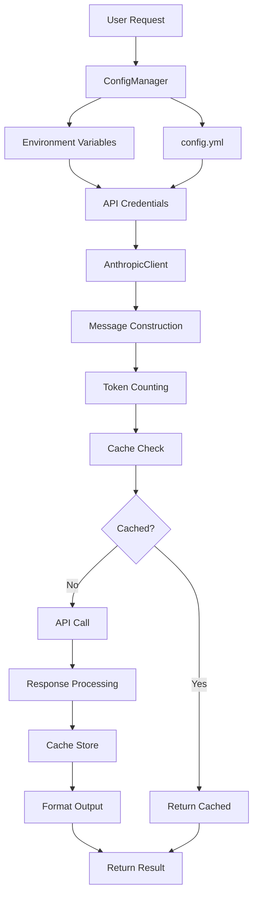
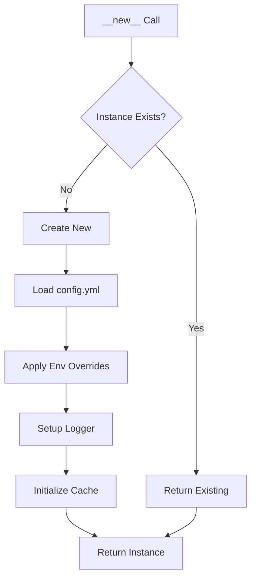
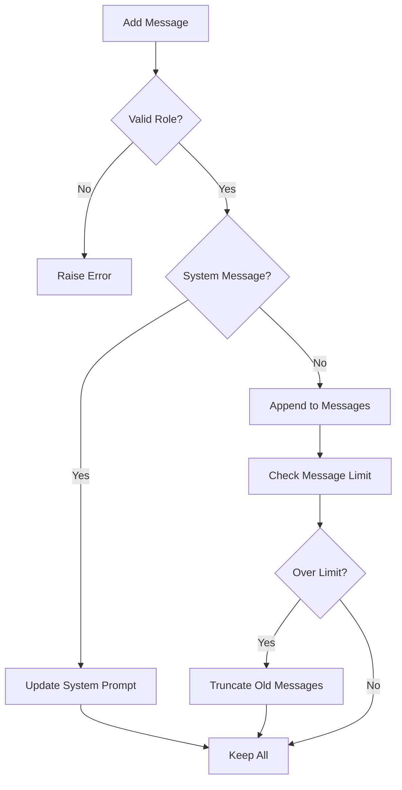
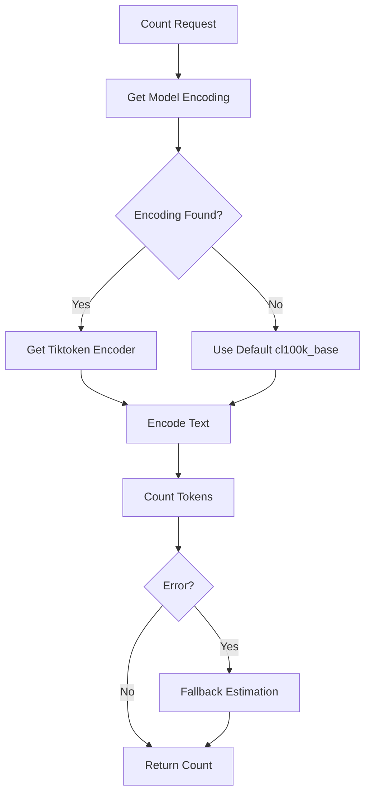
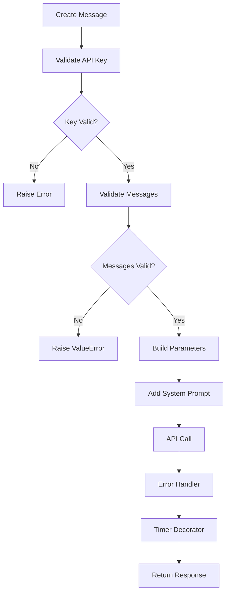
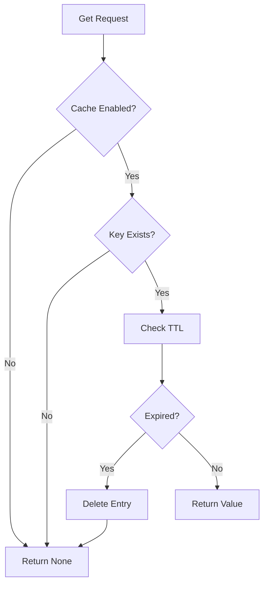
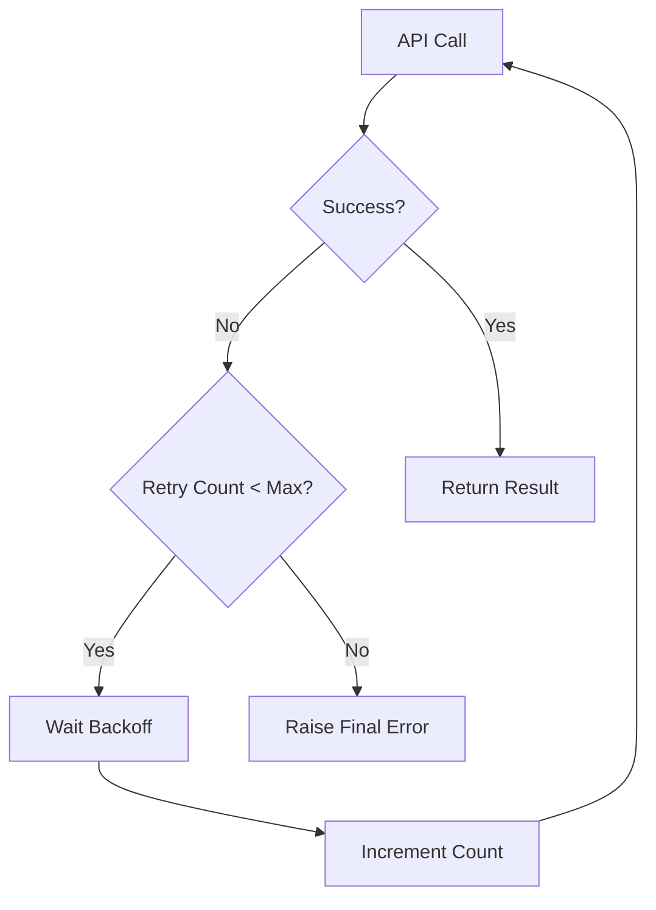

# 📋 helper_api.py 設計書

## 📝 目次

1. [📖 概要書](#📖-概要書)
2. [🔧 システム構成](#🔧-システム構成)
3. [📋 関数一覧](#📋-関数一覧)
4. [📑 関数詳細設計](#📑-関数詳細設計)
5. [⚙️ 技術仕様](#⚙️-技術仕様)
6. [🚨 エラーハンドリング](#🚨-エラーハンドリング)

---

## 📖 概要書

### 🎯 処理の概要

**Anthropic API ヘルパーライブラリ**

本ライブラリは、Anthropic Claude APIの操作を簡潔かつ効率的に行うための統合ヘルパーライブラリです。設定管理、メッセージ管理、トークン管理、レスポンス処理、キャッシュ機能など、API利用に必要な全機能を提供します。

#### 🌟 主要機能

| 機能 | 説明 |
|------|------|
| ⚙️ **設定管理** | YAMLベースの設定管理とシングルトンパターン |
| 💬 **メッセージ管理** | 会話履歴の管理と制限 |
| 🔢 **トークン管理** | トークンカウントとコスト推定 |
| 📊 **レスポンス処理** | API応答の解析と整形 |
| 💾 **キャッシュ機能** | メモリベースの高速キャッシュ |
| 🔌 **APIクライアント** | Anthropic API統合クライアント |

#### 🎨 処理対象データ



### 🔄 システムアーキテクチャ



---

## 🔧 システム構成

### 📦 主要コンポーネント



### 📋 データフロー



---

## 📋 関数一覧

### ⚙️ 設定管理関数

| 関数名 | 分類 | 処理概要 | 重要度 |
|--------|------|----------|---------|
| `ConfigManager.__init__()` | 🔧 初期化 | シングルトン設定管理初期化 | ⭐⭐⭐ |
| `ConfigManager.get()` | 📖 取得 | 設定値取得（キャッシュ付き） | ⭐⭐⭐ |
| `ConfigManager.set()` | ✏️ 更新 | 設定値更新 | ⭐⭐ |
| `ConfigManager.reload()` | 🔄 再読込 | 設定ファイル再読み込み | ⭐⭐ |
| `ConfigManager.save()` | 💾 保存 | 設定ファイル保存 | ⭐⭐ |
| `ConfigManager._setup_logger()` | 📝 ログ | ロガー設定 | ⭐⭐⭐ |

### 💾 キャッシュ管理関数

| 関数名 | 分類 | 処理概要 | 重要度 |
|--------|------|----------|---------|
| `MemoryCache.get()` | 📖 取得 | キャッシュ値取得 | ⭐⭐⭐ |
| `MemoryCache.set()` | ✏️ 設定 | キャッシュ値設定 | ⭐⭐⭐ |
| `MemoryCache.clear()` | 🗑️ クリア | キャッシュクリア | ⭐⭐ |
| `MemoryCache.size()` | 📊 サイズ | キャッシュサイズ取得 | ⭐ |

### 💬 メッセージ管理関数

| 関数名 | 分類 | 処理概要 | 重要度 |
|--------|------|----------|---------|
| `MessageManager.add_message()` | ➕ 追加 | メッセージ追加 | ⭐⭐⭐ |
| `MessageManager.get_messages()` | 📖 取得 | メッセージ履歴取得 | ⭐⭐⭐ |
| `MessageManager.clear_messages()` | 🗑️ クリア | 履歴クリア | ⭐⭐ |
| `MessageManager.export_messages()` | 📤 出力 | 履歴エクスポート | ⭐⭐ |
| `MessageManager.import_messages()` | 📥 入力 | 履歴インポート | ⭐⭐ |

### 🔢 トークン管理関数

| 関数名 | 分類 | 処理概要 | 重要度 |
|--------|------|----------|---------|
| `TokenManager.count_tokens()` | 🔢 カウント | トークン数計算 | ⭐⭐⭐ |
| `TokenManager.truncate_text()` | ✂️ 切詰 | テキスト切り詰め | ⭐⭐ |
| `TokenManager.estimate_cost()` | 💰 推定 | コスト推定 | ⭐⭐⭐ |
| `TokenManager.get_model_limits()` | 📊 制限 | モデル制限取得 | ⭐⭐ |

### 📊 レスポンス処理関数

| 関数名 | 分類 | 処理概要 | 重要度 |
|--------|------|----------|---------|
| `ResponseProcessor.extract_text()` | 📝 抽出 | テキスト抽出 | ⭐⭐⭐ |
| `ResponseProcessor.format_response()` | 📋 整形 | レスポンス整形 | ⭐⭐⭐ |
| `ResponseProcessor.save_response()` | 💾 保存 | レスポンス保存 | ⭐⭐ |

### 🔌 APIクライアント関数

| 関数名 | 分類 | 処理概要 | 重要度 |
|--------|------|----------|---------|
| `AnthropicClient.create_message()` | 📨 送信 | メッセージ送信 | ⭐⭐⭐ |
| `AnthropicClient.create_message_with_tools()` | 🔧 ツール | ツール付きメッセージ | ⭐⭐⭐ |
| `AnthropicClient.create_message_stream()` | 🌊 ストリーム | ストリーミング送信 | ⭐⭐ |

### 🛠️ ユーティリティ関数

| 関数名 | 分類 | 処理概要 | 重要度 |
|--------|------|----------|---------|
| `safe_json_serializer()` | 🔄 変換 | 安全なJSON変換 | ⭐⭐⭐ |
| `safe_json_dumps()` | 📝 出力 | 安全なJSON文字列化 | ⭐⭐⭐ |
| `sanitize_key()` | 🔑 変換 | キー文字列サニタイズ | ⭐⭐ |
| `create_session_id()` | 🆔 生成 | セッションID生成 | ⭐⭐ |

---

## 📑 関数詳細設計

### ⚙️ ConfigManager.__init__()

#### 🎯 処理概要
シングルトンパターンによる設定管理の初期化

#### 📊 処理の流れ


#### 📋 IPO設計

| 項目 | 内容 |
|------|------|
| **INPUT** | `config_path: str` (デフォルト: "config.yml") |
| **PROCESS** | 設定読込 → 環境変数適用 → ロガー設定 → キャッシュ初期化 |
| **OUTPUT** | ConfigManager インスタンス |

---

### 💬 MessageManager.add_message()

#### 🎯 処理概要
会話履歴へのメッセージ追加と制限管理

#### 📊 処理の流れ


#### 📋 IPO設計

| 項目 | 内容 |
|------|------|
| **INPUT** | `role: RoleType`, `content: str` |
| **PROCESS** | ロール検証 → メッセージ追加 → 制限チェック → 切り詰め |
| **OUTPUT** | なし（内部状態更新） |

---

### 🔢 TokenManager.count_tokens()

#### 🎯 処理概要
テキストのトークン数を正確にカウント

#### 📊 処理の流れ


#### 📋 IPO設計

| 項目 | 内容 |
|------|------|
| **INPUT** | `text: str`, `model: str` (オプション) |
| **PROCESS** | エンコーディング取得 → テキストエンコード → トークン数計算 |
| **OUTPUT** | `int` (トークン数) |

---

### 🔌 AnthropicClient.create_message()

#### 🎯 処理概要
Anthropic Messages APIへのメッセージ送信

#### 📊 処理の流れ


#### 📋 IPO設計

| 項目 | 内容 |
|------|------|
| **INPUT** | `messages: List[MessageParam]`, `model: str`, `system: str`, `max_tokens: int` |
| **PROCESS** | 検証 → パラメータ構築 → API呼び出し → エラー処理 |
| **OUTPUT** | `Message` (Anthropic Response) |

---

### 💾 MemoryCache.get()

#### 🎯 処理概要
TTL付きメモリキャッシュからの値取得

#### 📊 処理の流れ


#### 📋 IPO設計

| 項目 | 内容 |
|------|------|
| **INPUT** | `key: str` |
| **PROCESS** | 有効性確認 → TTLチェック → 値返却/削除 |
| **OUTPUT** | `Any` (キャッシュ値) または `None` |

---

## ⚙️ 技術仕様

### 📦 依存ライブラリ

| ライブラリ | バージョン | 用途 | 重要度 |
|-----------|-----------|------|---------|
| `anthropic` | 最新 | 🤖 Anthropic Claude API SDK | ⭐⭐⭐ |
| `tiktoken` | 最新 | 🔢 トークンカウント | ⭐⭐⭐ |
| `pyyaml` | 最新 | ⚙️ 設定ファイル管理 | ⭐⭐⭐ |
| `python-dotenv` | 最新 | 🔑 環境変数管理 | ⭐⭐ |

### 🗃️ 設定ファイル構造

#### 📋 config.yml スキーマ

```yaml
models:
  default: "claude-sonnet-4-20250514"
  available:
    - "claude-opus-4-1-20250805"
    - "claude-sonnet-4-20250514"
    - "claude-3-5-sonnet-20241022"
    - "claude-3-5-haiku-20241022"

api:
  timeout: 30
  max_retries: 3
  anthropic_api_key: null  # 環境変数で上書き
  anthropic_api_base: null
  message_limit: 50

cache:
  enabled: true
  ttl: 3600
  max_size: 100

logging:
  level: "INFO"
  format: "%(asctime)s - %(name)s - %(levelname)s - %(message)s"
  file: null
  max_bytes: 10485760
  backup_count: 5

model_pricing:
  claude-opus-4-1-20250805:
    input: 0.015
    output: 0.075
  claude-sonnet-4-20250514:
    input: 0.003
    output: 0.015
```

### 💾 キャッシュ仕様

#### 🗂️ キャッシュ構造

```python
cache_entry = {
    'result': Any,           # キャッシュ値
    'timestamp': float,      # 保存時刻（Unix時間）
}

cache_storage = {
    'cache_key_1': cache_entry,
    'cache_key_2': cache_entry,
    # ...
}
```

### 🔐 環境変数

| 変数名 | 説明 | 必須 |
|--------|------|------|
| `ANTHROPIC_API_KEY` | Anthropic APIキー | ✓ |
| `ANTHROPIC_API_BASE` | APIベースURL（カスタム） | ✗ |
| `LOG_LEVEL` | ログレベル | ✗ |
| `DEBUG_MODE` | デバッグモード | ✗ |

---

## 🚨 エラーハンドリング

### 📄 エラー分類

| エラー種別 | 原因 | 対処法 | 影響度 |
|-----------|------|--------|---------|
| **APIキーエラー** | 🔑 APIキー未設定/無効 | 環境変数設定 | 🔴 高 |
| **設定読込エラー** | 📁 config.yml不在/不正 | デフォルト設定使用 | 🟡 中 |
| **トークンエラー** | 🔢 エンコーディング失敗 | 簡易推定使用 | 🟠 低 |
| **キャッシュエラー** | 💾 容量超過 | 古いエントリ削除 | 🟠 低 |
| **JSONシリアライズエラー** | 📝 非対応オブジェクト | フォールバック処理 | 🟡 中 |

### 🛠️ エラー処理戦略

```python
# デコレータによるエラー処理
@error_handler
def api_function():
    # エラーはログ記録後、再発生
    pass

# 安全なJSON処理
def safe_json_serializer(obj):
    # 複数のフォールバック戦略
    if hasattr(obj, 'model_dump'):
        return obj.model_dump()
    elif hasattr(obj, 'dict'):
        return obj.dict()
    else:
        return str(obj)

# 設定のフォールバック
def _load_config():
    try:
        # YAMLファイル読み込み
        return yaml.safe_load(f)
    except Exception:
        # デフォルト設定返却
        return self._get_default_config()
```

### 🎨 ロギング戦略

```python
# ログレベル別処理
logger.debug("詳細デバッグ情報")
logger.info("一般情報")
logger.warning("警告メッセージ")
logger.error("エラー詳細")
logger.critical("致命的エラー")

# ローテーションログ
file_handler = RotatingFileHandler(
    filename="app.log",
    maxBytes=10485760,  # 10MB
    backupCount=5
)
```

### 🔄 リトライ戦略



---

## 🎉 まとめ

この設計書は、**helper_api.py** の包括的な技術仕様と実装詳細を網羅した完全ドキュメントです。

### 🌟 設計のハイライト

- **⚙️ 統合設定管理**: YAMLベースの柔軟な設定システム
- **💾 効率的キャッシュ**: TTL付きメモリキャッシュ
- **🔢 正確なトークン管理**: tiktoken による正確なカウント
- **🛡️ 堅牢性**: 包括的なエラーハンドリング
- **📊 コスト最適化**: 料金推定とトークン管理

### 🔧 アーキテクチャ特徴

- **📦 シングルトンパターン**: 設定管理の一元化
- **🔄 デコレータパターン**: 横断的関心事の分離
- **💾 メモリ効率**: サイズ制限付きキャッシュ
- **🎯 拡張性**: 新モデル・機能の容易な追加