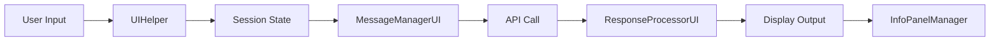
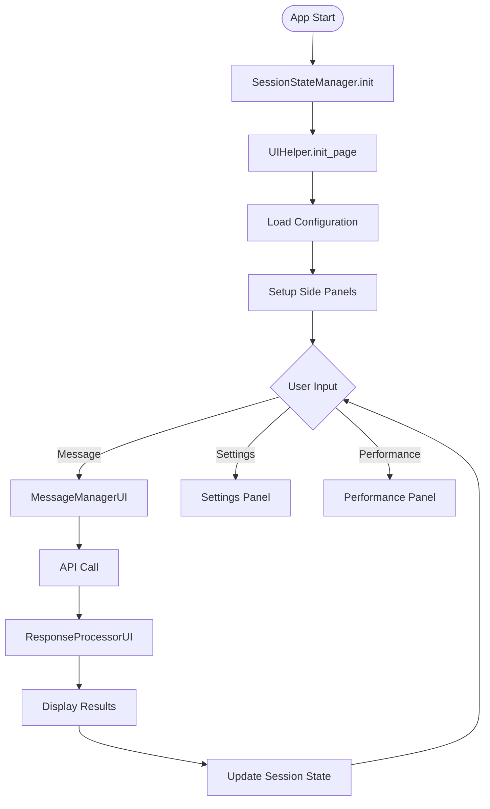
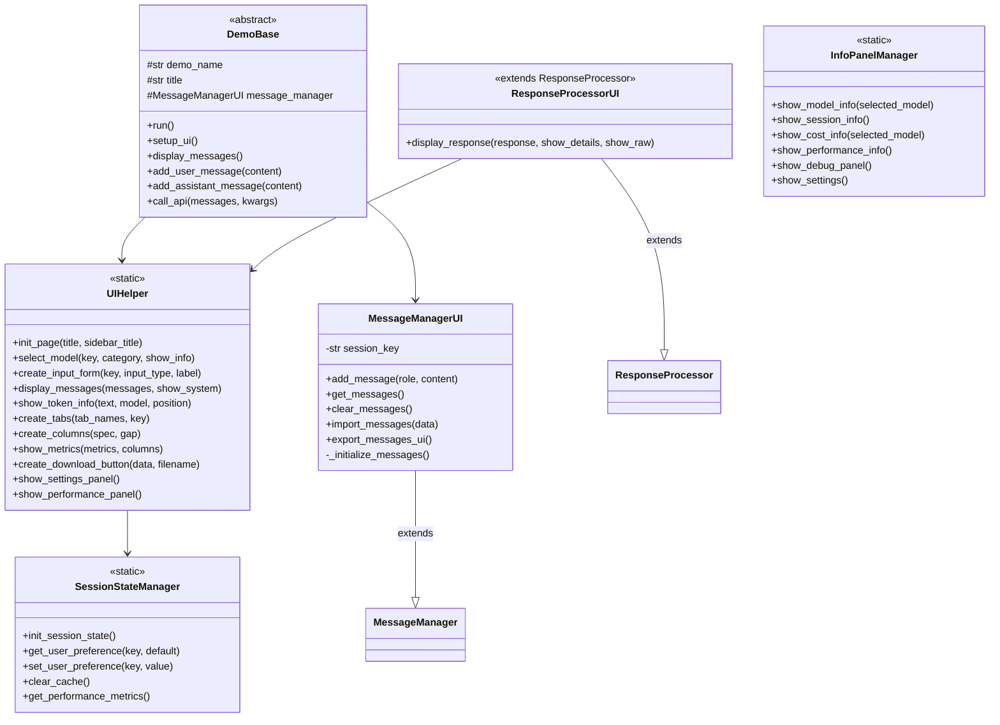
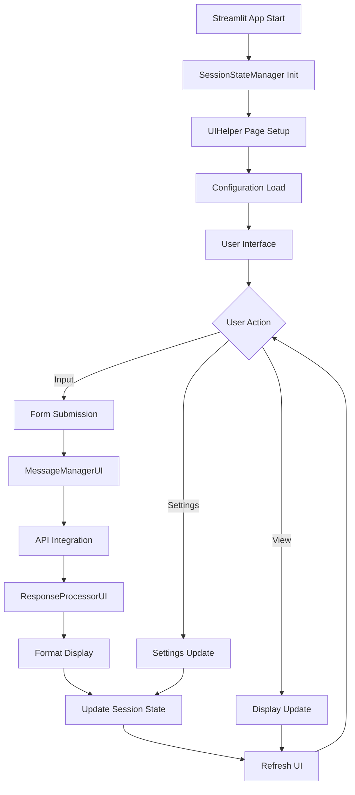
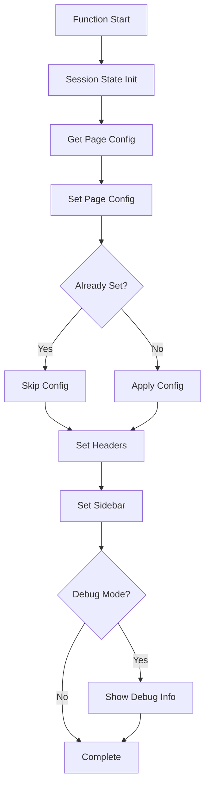
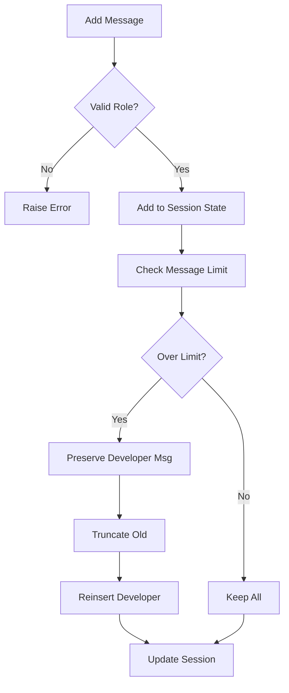
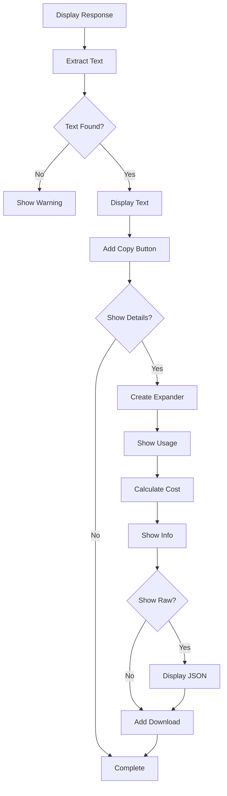
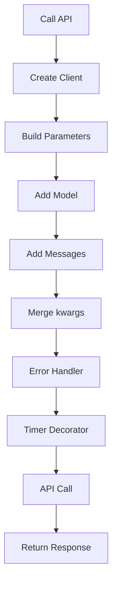
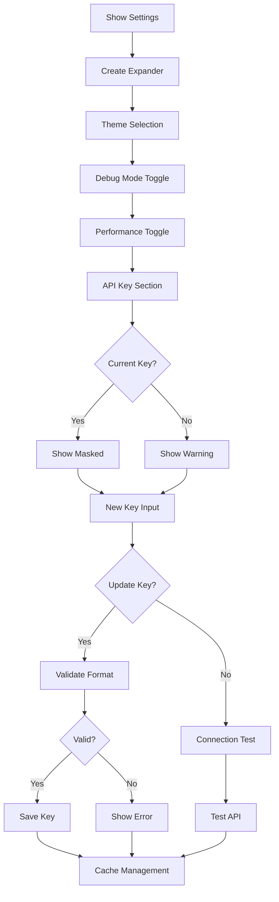
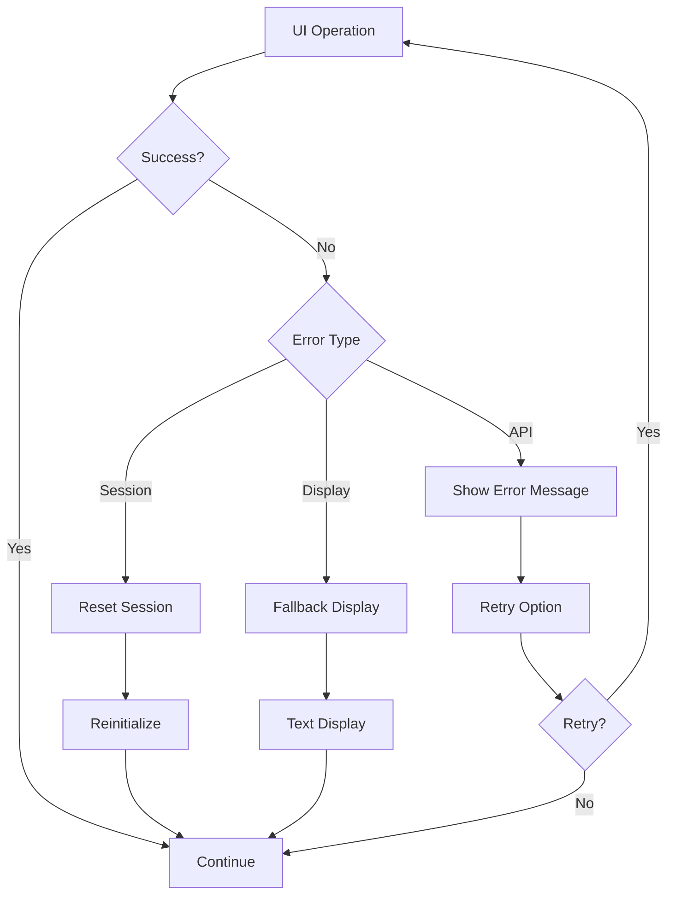

# 📋 helper_st.py 設計書

## 📝 目次

1. [📖 概要書](#📖-概要書)
2. [🔧 システム構成](#🔧-システム構成)
3. [📋 関数一覧](#📋-関数一覧)
4. [📑 関数詳細設計](#📑-関数詳細設計)
5. [⚙️ 技術仕様](#⚙️-技術仕様)
6. [🚨 エラーハンドリング](#🚨-エラーハンドリング)

---

## 📖 概要書

### 🎯 処理の概要

**Streamlit UI ヘルパーライブラリ (Anthropic API専用)**

本ライブラリは、Anthropic Claude APIを使用したStreamlitアプリケーション開発を支援するUI専用ヘルパーライブラリです。セッション管理、メッセージ表示、レスポンス処理、パフォーマンス監視など、UI開発に必要な包括的な機能を提供します。

#### 🌟 主要機能

| 機能 | 説明 |
|------|------|
| 🎨 **UIヘルパー** | 統一されたUI要素と設定パネル |
| 💬 **メッセージ管理UI** | 会話履歴の表示と管理 |
| 📊 **レスポンス表示** | API応答の整形表示 |
| 💾 **セッション状態管理** | Streamlitセッション状態の統合管理 |
| 📈 **パフォーマンス監視** | 実行時間測定と表示 |
| 🎯 **デモ基底クラス** | 再利用可能なデモ実装基盤 |

#### 🎨 処理対象データ



### 🔄 システムアーキテクチャ



---

## 🔧 システム構成

### 📦 主要コンポーネント



### 📋 データフロー



---

## 📋 関数一覧

### 💾 セッション管理関数

| 関数名 | 分類 | 処理概要 | 重要度 |
|--------|------|----------|---------|
| `SessionStateManager.init_session_state()` | 🔧 初期化 | セッション状態初期化 | ⭐⭐⭐ |
| `SessionStateManager.get_user_preference()` | 📖 取得 | ユーザー設定取得 | ⭐⭐ |
| `SessionStateManager.set_user_preference()` | ✏️ 設定 | ユーザー設定保存 | ⭐⭐ |
| `SessionStateManager.clear_cache()` | 🗑️ クリア | キャッシュクリア | ⭐⭐ |
| `SessionStateManager.get_performance_metrics()` | 📊 取得 | パフォーマンス情報取得 | ⭐ |

### 🎨 UIヘルパー関数

| 関数名 | 分類 | 処理概要 | 重要度 |
|--------|------|----------|---------|
| `UIHelper.init_page()` | 🎯 初期化 | ページ初期化設定 | ⭐⭐⭐ |
| `UIHelper.select_model()` | 🤖 選択 | モデル選択UI | ⭐⭐⭐ |
| `UIHelper.create_input_form()` | 📝 入力 | 入力フォーム作成 | ⭐⭐⭐ |
| `UIHelper.display_messages()` | 💬 表示 | メッセージ履歴表示 | ⭐⭐⭐ |
| `UIHelper.show_token_info()` | 🔢 情報 | トークン情報表示 | ⭐⭐ |
| `UIHelper.create_download_button()` | 📥 ダウンロード | ダウンロードボタン作成 | ⭐⭐ |
| `UIHelper.show_settings_panel()` | ⚙️ 設定 | 設定パネル表示 | ⭐⭐⭐ |
| `UIHelper.show_performance_panel()` | 📈 性能 | パフォーマンスパネル表示 | ⭐⭐ |

### 💬 メッセージ管理UI関数

| 関数名 | 分類 | 処理概要 | 重要度 |
|--------|------|----------|---------|
| `MessageManagerUI.add_message()` | ➕ 追加 | メッセージ追加 | ⭐⭐⭐ |
| `MessageManagerUI.get_messages()` | 📖 取得 | メッセージ履歴取得 | ⭐⭐⭐ |
| `MessageManagerUI.clear_messages()` | 🗑️ クリア | 履歴クリア | ⭐⭐ |
| `MessageManagerUI.export_messages_ui()` | 📤 出力 | UI用履歴エクスポート | ⭐⭐ |

### 📊 レスポンス処理UI関数

| 関数名 | 分類 | 処理概要 | 重要度 |
|--------|------|----------|---------|
| `ResponseProcessorUI.display_response()` | 🖥️ 表示 | レスポンス表示 | ⭐⭐⭐ |

### 🎯 デモ基底クラス関数

| 関数名 | 分類 | 処理概要 | 重要度 |
|--------|------|----------|---------|
| `DemoBase.__init__()` | 🔧 初期化 | デモ基底初期化 | ⭐⭐⭐ |
| `DemoBase.run()` | 🎯 実行 | デモ実行（抽象） | ⭐⭐⭐ |
| `DemoBase.setup_ui()` | 🎨 設定 | UI共通設定 | ⭐⭐⭐ |
| `DemoBase.call_api()` | 🔌 API | API呼び出し共通処理 | ⭐⭐⭐ |

### 📋 情報パネル管理関数

| 関数名 | 分類 | 処理概要 | 重要度 |
|--------|------|----------|---------|
| `InfoPanelManager.show_model_info()` | 🤖 情報 | モデル情報表示 | ⭐⭐ |
| `InfoPanelManager.show_session_info()` | 📊 状態 | セッション情報表示 | ⭐⭐ |
| `InfoPanelManager.show_cost_info()` | 💰 料金 | 料金計算表示 | ⭐⭐⭐ |
| `InfoPanelManager.show_performance_info()` | ⚡ 性能 | パフォーマンス情報表示 | ⭐⭐ |
| `InfoPanelManager.show_debug_panel()` | 🐛 デバッグ | デバッグ情報表示 | ⭐ |

### 🛠️ デコレータ関数

| 関数名 | 分類 | 処理概要 | 重要度 |
|--------|------|----------|---------|
| `error_handler_ui()` | 🛡️ エラー | UIエラーハンドリング | ⭐⭐⭐ |
| `timer_ui()` | ⏱️ 計測 | UI実行時間計測 | ⭐⭐ |
| `cache_result_ui()` | 💾 キャッシュ | UI結果キャッシュ | ⭐⭐ |

---

## 📑 関数詳細設計

### 🎨 UIHelper.init_page()

#### 🎯 処理概要
Streamlitページの初期化と基本設定

#### 📊 処理の流れ


#### 📋 IPO設計

| 項目 | 内容 |
|------|------|
| **INPUT** | `title: str`, `sidebar_title: str`, `**kwargs` |
| **PROCESS** | セッション初期化 → ページ設定 → ヘッダー設定 → デバッグ表示 |
| **OUTPUT** | なし（UIレンダリング） |

---

### 💬 MessageManagerUI.add_message()

#### 🎯 処理概要
Streamlitセッション状態へのメッセージ追加

#### 📊 処理の流れ


#### 📋 IPO設計

| 項目 | 内容 |
|------|------|
| **INPUT** | `role: RoleType`, `content: str` |
| **PROCESS** | ロール検証 → セッション追加 → 制限管理 → 状態更新 |
| **OUTPUT** | なし（セッション状態更新） |

---

### 📊 ResponseProcessorUI.display_response()

#### 🎯 処理概要
API応答の整形表示とインタラクティブ要素

#### 📊 処理の流れ


#### 📋 IPO設計

| 項目 | 内容 |
|------|------|
| **INPUT** | `response: Response`, `show_details: bool`, `show_raw: bool` |
| **PROCESS** | テキスト抽出 → 表示 → 詳細情報 → ダウンロード |
| **OUTPUT** | なし（UI表示） |

---

### 🎯 DemoBase.call_api()

#### 🎯 処理概要
デモ共通のAPI呼び出し処理

#### 📊 処理の流れ


#### 📋 IPO設計

| 項目 | 内容 |
|------|------|
| **INPUT** | `messages: List[MessageParam]`, `**kwargs` |
| **PROCESS** | クライアント作成 → パラメータ構築 → API呼び出し |
| **OUTPUT** | `Response` (API応答) |

---

### ⚙️ UIHelper.show_settings_panel()

#### 🎯 処理概要
設定パネルの表示とAPIキー管理

#### 📊 処理の流れ


#### 📋 IPO設計

| 項目 | 内容 |
|------|------|
| **INPUT** | なし（現在の設定を読込） |
| **PROCESS** | 設定表示 → 変更受付 → 検証 → 保存 |
| **OUTPUT** | なし（設定更新・UI表示） |

---

## ⚙️ 技術仕様

### 📦 依存ライブラリ

| ライブラリ | バージョン | 用途 | 重要度 |
|-----------|-----------|------|---------|
| `streamlit` | 最新 | 🎨 Web UIフレームワーク | ⭐⭐⭐ |
| `anthropic` | 最新 | 🤖 Anthropic Claude API SDK | ⭐⭐⭐ |
| `pandas` | 最新 | 📊 データ処理（オプション） | ⭐ |

### 💾 セッション状態構造

#### 🗂️ セッション状態スキーマ

```python
session_state = {
    'initialized': bool,
    'ui_cache': Dict[str, Any],
    'performance_metrics': List[Dict],
    'user_preferences': Dict[str, Any],
    'messages_[demo_name]': List[MessageParam],
    'selected_model': str,
    'show_timestamps': bool,
}
```

### 🎨 UI コンポーネント仕様

#### 📋 標準UIレイアウト

```python
# ページ構成
st.set_page_config(
    page_title="Title",
    page_icon="🤖",
    layout="wide",
    initial_sidebar_state="expanded"
)

# サイドバー構成
with st.sidebar:
    # モデル選択
    model = st.selectbox(...)
    
    # 設定パネル
    with st.expander("⚙️ 設定"):
        # 設定項目
        
    # 情報パネル
    with st.expander("📊 情報"):
        # 統計情報
```

### 📈 パフォーマンス監視

#### 🔍 メトリクス構造

```python
performance_metric = {
    'function': str,        # 関数名
    'execution_time': float,  # 実行時間（秒）
    'timestamp': datetime    # 実行時刻
}
```

### 🔐 安全なJSON処理

#### 📝 シリアライゼーション戦略

```python
def safe_streamlit_json(data, expanded=True):
    try:
        # 直接表示試行
        st.json(data, expanded)
    except:
        try:
            # カスタムシリアライザー使用
            json_str = safe_json_dumps(data)
            st.json(json.loads(json_str))
        except:
            # 最終フォールバック
            st.code(str(data), language="python")
```

---

## 🚨 エラーハンドリング

### 📄 エラー分類

| エラー種別 | 原因 | 対処法 | 影響度 |
|-----------|------|--------|---------|
| **セッション状態エラー** | 💾 状態不整合 | セッションリセット | 🟡 中 |
| **UI表示エラー** | 🎨 レンダリング失敗 | フォールバック表示 | 🟠 低 |
| **JSON表示エラー** | 📝 シリアライズ失敗 | テキスト表示 | 🟠 低 |
| **API接続エラー** | 🔌 通信失敗 | エラーメッセージ表示 | 🟡 中 |
| **設定エラー** | ⚙️ 無効な設定値 | デフォルト値使用 | 🟠 低 |

### 🛠️ エラー処理戦略

```python
@error_handler_ui
def ui_function():
    # エラー時はUI表示、例外は抑制
    try:
        # 処理
    except Exception as e:
        st.error(f"エラー: {e}")
        if debug_mode:
            st.exception(e)
```

### 🎨 エラー表示パターン

```python
# 段階的エラー表示
def display_error(error_type, error_msg):
    if error_type == "critical":
        st.error(f"❌ 重大なエラー: {error_msg}")
        st.stop()
    elif error_type == "warning":
        st.warning(f"⚠️ 警告: {error_msg}")
    else:
        st.info(f"ℹ️ 情報: {error_msg}")
```

### 🔄 エラー復旧フロー



---

## 🎉 まとめ

この設計書は、**helper_st.py** の包括的な技術仕様と実装詳細を網羅した完全ドキュメントです。

### 🌟 設計のハイライト

- **🎨 統一UI**: 一貫性のあるユーザーインターフェース
- **💾 状態管理**: Streamlitセッション状態の効率的管理
- **📈 監視機能**: パフォーマンス監視と表示
- **🛡️ 堅牢性**: 包括的なエラーハンドリング
- **🔄 再利用性**: デモ基底クラスによる効率的開発

### 🔧 アーキテクチャ特徴

- **📦 コンポーネント設計**: 再利用可能なUI部品
- **🎯 デコレータパターン**: 横断的関心事の分離
- **💬 メッセージ管理**: 会話履歴の統合管理
- **📊 情報パネル**: 包括的な情報表示システム